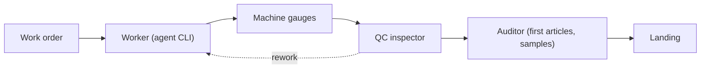

<p align="center">
  <picture>
    <source media="(prefers-color-scheme: dark)" srcset="assets/logo-lockup-dark.svg">
    
  </picture>
</p>

<p align="center"><strong>Own the factory. Rent the agents and the intelligence.</strong></p>

A dark factory for AI coding work. The factory (work orders, gauges, the event log, its
memory) is files you own. Agents and models are rented from any vendor and swapped at will:
cheap disposable agents build, deterministic gauges check every claim, and one frontier
lead makes only the critical calls.

[](https://github.com/suzworx/flywheel/actions)
[](https://github.com/suzworx/flywheel/releases)
[](LICENSE)
[](https://suzworx.github.io/flywheel/)

**Docs and quickstart → [suzworx.github.io/flywheel](https://suzworx.github.io/flywheel/)**

## Built by flywheel

Flywheel is built by flywheel. Sujeet ([@suzworx](https://github.com/suzworx)) runs its
development as a dark factory.

- From v0.3.0 on, flywheel's own features (`flywheel run`, the gauges `validate`, `inspect` and
  `verify`, the `flywheel factory` view), the CLI help and flag fixes, and the factory design
  docs were built as work orders by disposable OpenCode workers on DeepSeek v4 flash (variant
  max).
- Since September 2026 the workers are `claude-haiku-4-5` agents dispatched through the `claude`
  adapter, and the lead is Claude. Across 30 units (33 attempts) a unit cost a median $0.55
  (range $0.27-1.63) and took a median 14 minutes; every attempt finished cleanly, yet the
  lead's review and an independent PR reviewer still caught defects in most units, which is
  why every claim is re-measured rather than trusted.
- Each work order is a brief with `owns:`, `needs:` and `gate:` lines. flywheel's own gauges
  re-run the gates on the exact tree hash and check `owns:`; inspection and `flywheel verify`
  (rules T1, T3, T4, T5 and T8) gate every commit. Workers never commit.
- One frontier lead seat outlines work orders, reviews diffs, runs checks against the built
  binary and signs off. The lead seat changed hands between vendors mid-project and the work
  continued from the files.
- Measured worker cost: the CLI help and flag work took 7 units, 1.7M tokens and $0.33; a
  design doc was drafted, corrected and extended by 5 units for about $0.03; a code unit costs
  $0.03-0.08 and takes 15-29 minutes.

The house rules the workers follow are in [AGENTS.md](AGENTS.md).

## The factory

Flywheel is a factory for AI coding work: a small Go CLI plus agent skills that run a durable
**orchestrator-to-worker loop**. A frontier lead agent plans, briefs and judges; cheap disposable
worker agents (Claude Code, Codex or OpenCode) do the reading, writing and testing. The **control plane** dispatches
work and enforces policy; the **data plane** keeps traceability, telemetry and accountability for
every session.

### Roles

| Factory role | Persona | Does | Never |
| --- | --- | --- | --- |
| Plant manager | lead | sets goals and policy, handles escalations, signs off | implements |
| Production planner | planner | turns a spec into work orders (`owns:`/`needs:`/gates) | dispatches or inspects |
| Line supervisor | foreman | runs a line of workers, retries by policy, pulls the cord | plans or implements |
| Line worker | worker (any agent CLI) | builds one work order at its own station | plans, inspects, commits |
| Machine gauges | supervisor (CLI, no model) | measures every unit: runs gates, checks `owns:` | judges intent |
| QC inspector | inspector | inspects a unit against its work order | runs gauges or fixes units |
| External auditor | auditor | audits first articles and samples, files nonconformances | works the line |
| Continuous improvement | steward | turns signals and nonconformances into learnings | changes units |
| Owner | operator | installs, assigns roles, sets merge and publish policy | — |

### A unit's path



### Set up, run, watch

- **Set up** — `flywheel init` scaffolds `flywheel.md` plus the `.flywheel/` state files
  (available in v0.2.0). It ends with a factory summary — the worker lines, limits, audit policy, which enforcement layers are installed (and the command for each missing one) and how to view the floor. Building the full factory — lines, staffing, and the policy that keeps it
  safe — is [epic #69](https://github.com/suzworx/flywheel/issues/69).
- **Run** — the lead records each work order as an event with `flywheel log --kind planned`;
  `flywheel run` dispatches it to a worker through the `claude`, `codex` or `opencode` adapter and
  records the run automatically. For parallel units `flywheel run --worktree` is the default: each
  unit builds in its own `.flywheel/worktrees/<task>` on branch `fw/<task>`, against the main ledger.
  `--worktree --base REF` branches a new `fw/<task>` from REF (say the `integration.branch`) instead
  of the main checkout's HEAD, without checking REF out; the `dispatched` event's `base` records the
  commit the unit branched from.
  `flywheel run --session ID` (default `$FLYWHEEL_SESSION`) records the dispatching lead session as
  the dispatched event's `lead`, so leads sharing one ledger can tell their units apart.
- **Watch** — `flywheel state` derives the floor from the event log; `flywheel factory` opens an interactive, k9s-style view of the floor (`:units` `:workers` `:andon` `:events` `:lines` to switch, `/` to filter, enter to explain a unit, `l` for its log, `?` for help, `q` to quit; `--plain` keeps the plain redraw), and `flywheel watch` streams every event as one readable line.
  When any unit runs in a worktree, the plain floor's (`flywheel factory --plain`) units table adds a TREE column with that worktree and its base commit (`CP-A@abcdef1`), and the `--json` view carries `workdir` and `base`.
- **Know when a unit finishes** — never background a dispatch with a bare `&` and hope to notice:
  `flywheel wait <task>... [--timeout D]` blocks until each named task finishes its current (or
  first) attempt, printing `<task> <attempt> finished reason=<r>` as each lands (exit 0 all clean,
  4 any unclean, 8 timeout), and `flywheel run <task> --notify CMD` runs `CMD` through the shell
  when the run returns on any path, with `FLYWHEEL_FINISHED="<task> <attempt> reason=<r> exit=<code>"`
  in its environment; a failing notify only warns.

Design priorities, in order: **efficiency and consistency**, then **speed, reliability and
recoverability** — the lead spends tokens only where judgment is needed, gauges and telemetry cost
no tokens, and everything replays from the log after any crash.

## Why flywheel

Frontier-quality results at a fraction of frontier cost — measured, not promised: the field run
behind the skills used **99 worker runs across 44 tasks, up to 7 workers in parallel, and about
90 % of all worker input across the field run served from the model cache**. `max_parallel` caps
concurrent *workers*, not concurrent *gates*: units whose `gate:` lines name the same expensive
command serialise on it, and the contention manufactures false findings (phantom timeouts) that
read as code defects — `flywheel run` prints a shared-gate warning at dispatch whenever an
in-flight unit declares the same gate line.

The goal is to ship with no human in the loop. That is only safe if every step is **recorded** (an
append-only event log), **measured** by the machine (gauges run by the CLI, never self-reported by
an agent), and **audited** by independent checkers. Today all three are in place: the append-only
event log is hash-chained, so an edited record, or one removed from the middle, is detected
(`flywheel verify --log`; cutting records off the end needs an outside anchor such as a pushed
commit); the gauges `validate`, `inspect` and `verify` measure
every unit, with `flywheel supervise` measuring each finished unit nobody has measured yet; and
`flywheel audit` re-measures a unit in a clean copy from a session that neither built nor inspected
it, selecting first articles and seeded samples
([#61](https://github.com/suzworx/flywheel/issues/61)). Enforcement sits in more than one layer:
the CLI refuses illegal transitions (exit 6), an agent Stop hook runs `flywheel gate`, and git
hooks check every commit and push (`flywheel init --git-hooks`); whatever the worker's adapter,
`flywheel run` flags an attempt that moved HEAD, switched branch or stashed with a `git-write`
signal, which blocks landing until the lead triages it (it compares the attempt's end points, so a
push or a write undone before exit needs the command-level guard,
[#319](https://github.com/suzworx/flywheel/issues/319)). That guard is in place: `flywheel run`
puts a `git` shim first on the worker's PATH that passes only read-only commands (status, diff, log,
show, grep, blame, rev-parse, … and the listing forms of branch, tag, config, stash) to the real
git and refuses everything else — commit, push, stash, reset, checkout, add, rm, clean, an alias —
in the unit's repository (git in a test's own temporary repository runs normally, and flywheel's
temporary-index tree hashing is allowed), and a run whose guard cannot be installed is refused; a worker that calls git by an absolute path
bypasses it, and the end-point check still applies.

Any agent can lead. The loop lives in repository files and shell commands, not inside any one
vendor's session, so a new head — Claude Code, Codex, OpenCode, or a human — reads the same state
and continues the same work.

## How it works

The loop is five steps: **Plan → Brief → Dispatch → Review → Correct-or-land**. Steps 1, 4 and 5
are lead judgment; 2 and 3 are mechanical.

**Repo is the session.** All state lives in the repository as files — the event log, work orders,
worker plans, reports — not inside any vendor session. That is what makes agents swappable and the
loop crash-safe: run out of tokens, hit a host timeout, lose a watcher; the next head reads the
same files and continues, and nothing is lost.

**Sharded log.** By default the event log is a single `.flywheel/events.jsonl` file. For large factories
with many parallel tasks, `flywheel log --shard` switches to per-task shards under `.flywheel/events/`:
one file per task plus `@floor.jsonl` for global events (goals, feedback, etc.) and `@session-<id>.jsonl`
for session boundary events. The sharded layout is one-way — the legacy file is sealed and kept — and
opt-in via config so older binaries are fenced out. Readers merge the legacy file first, then stable by
each shard's running-max timestamp, preserving the linearized order. Each shard has its own hash chain
with a genesis block and a `sharded` seal (with the kind's fields), and `flywheel verify --log` checks
them all. Transient shard locks under `.flywheel/locks/` guard concurrent writes per shard and are
git-ignored.

Two design docs define the factory:

- [Autonomous shipping: the flywheel factory](docs/design/autonomous-shipping.md) — the factory
  model, the required events, the poka-yoke transition rules, and the enforcement layers.
- [Flywheel at scale](docs/design/flywheel-at-scale.md) — personas, many parallel workers,
  per-task worktrees and landing, native feedback, and offline use.

## See it

Real transcripts from this branch, rendered from actual CLI output.

*`flywheel init` scaffolds `flywheel.md` plus the `.flywheel/` state files.*


*A task's life is recorded in the append-only event log; state is derived from the log, not stored
alongside it.*


*Real output: the worker's tree-rewriting git commands are refused even under `--auto`; read-only
git still works.*


*The gauges measure the tree; inspect refuses to pass a unit that has no supervisor readings on record.*


*Real output: the factory floor at a fixed instant, showing landed, running, finished-awaiting-inspection, capped and planned units.*


### Measure, don't trust

`flywheel validate` runs a task's gates and checks its `owns` boundary, recording supervisor readings; `flywheel inspect` only passes a unit whose readings are on record (and refuses a worker session's verdict); `flywheel verify` checks every poka-yoke rule. `validate` exits 5 when a gate fails or a change sits outside `owns`, and an `inspect` refusal exits 6.

### Worker adapters

`flywheel run` dispatches through one of four adapters: `claude`, `codex`, `opencode`, or the
offline `sim` adapter used by tests and this repo's own demo. Each worker in
`.flywheel/config.json` names its adapter; `flywheel run --worker <name>` picks between several
configured workers, so one factory can mix them. The `claude` adapter (issue
[#49](https://github.com/suzworx/flywheel/issues/49)) builds this repository: its units are
dispatched to `claude-haiku-4-5` workers through it. The `codex` adapter (issue
[#275](https://github.com/suzworx/flywheel/issues/275)) runs `codex exec --json --sandbox
workspace-write`, points the worker at the brief file (the prompt stays one line, so the Windows
npm shim cannot truncate it), and parses Codex's JSONL events; Codex reports tokens but no cost,
so `limits.budget` does not count its spend. Resume uses `codex exec resume <thread id>`.

On the `claude` adapter, a worker's only way to run its own gate lines is its Bash tool, and
`--permission-mode acceptEdits` alone grants file edits — not commands. Each worker in
`.flywheel/config.json` can therefore set `allowed_tools` and `disallowed_tools` (Claude Code
tool patterns) to shape the dispatch's `--allowedTools`/`--disallowedTools`. Unset, a worker
defaults to `allowed_tools: ["Bash"]` and a `disallowed_tools` covering the git-write family
(`Bash(git commit:*)`, `Bash(git push:*)`, `Bash(git stash:*)`, `Bash(git reset:*)`,
`Bash(git checkout:*)`, `Bash(git rebase:*)`, `Bash(git merge:*)`): the worker can run its own
gates but still cannot commit, stash, reset, checkout, rebase or merge — the worker permission
policy is enforced by the permission layer, not by asking nicely. An explicitly configured list
replaces its default; it is not merged with it, so an operator can widen or narrow deliberately.
A misspelt key is named with its nearest known key (`unknown key "allowedTools"; did you mean
"allowed_tools"?`, issue #463).
A claude worker's `permission_mode` sets its `--permission-mode`: `acceptEdits` (the default),
`bypassPermissions`, `default`, `plan` or `dontAsk`; `disallowed_tools` is still enforced under
every mode, `bypassPermissions` included. A tool the worker is denied raises the
`permission-denied` andon live, while the run is still going (`andon: <task> <attempt>
permission-denied <tool> (live)`), and `flywheel lint` warns when a brief asks for web research
but the default claude worker has no WebSearch/WebFetch in `allowed_tools` (issue #526).
A claude worker loads no MCP servers (`--strict-mcp-config`) unless its `mcp` key lists them in
the `--mcp-config` shape, e.g. `"mcp": {"mcpServers": {"fs": {"command": "mcp-fs"}}}` (issue #425).

`flywheel run` exits 0 on a clean finish, exit 3 on a silent start (no output before the start
timeout), 4 when the worker exited nonzero, capped, or hit a provider error, and exit 7 on a
mid-stream stall (no run-file line for the stall timeout while the process is still alive).
`limits.breaker` stops dispatching to a model after consecutive provider errors, until a cooldown
passes; unless `--model` was given, an approved fallback takes over (`fallbacks[{model, approved: true}]`,
the first whose own breaker is closed).
A worker's optional `routing` block (`candidates`, `objective` one of `cost_per_accepted`, `accepted_rate`, `gate_pass_rate` or `clean_rate`, `explore`, `min_attempts`, `seed`) makes `flywheel run` pick each fresh dispatch's model from the `flywheel stats --by model` scoreboard, exploring another candidate by a deterministic draw (same ledger, seed and task, same choice) and recording the choice as `route` on `dispatched`. A brief's optional `kind:` header (`feature`, `fix`, `refactor`, `test`, `docs`, `chore` or `perf` by default; `lint.kinds` in config replaces the list, and `flywheel lint` checks it) routes on that kind's own scoreboard once any candidate has enough attempts there, and on the model-wide one otherwise, `route.basis` saying which ([#475](https://github.com/suzworx/flywheel/issues/475)).
It is off by default; `--model` overrides it, a `--resume` keeps its model, and the breaker still applies to the routed model.
`limits.budget.wave_tokens` caps the wave's recorded tokens (input, output and reasoning — a cost budget cannot cap an adapter that reports no cost), and `limits.rate_per_minute` caps dispatches of one model in any 60 seconds; both are refused by `flywheel run` (exit 6, rules `budget` and `rate`); `flywheel next` HOLDs on a spent token budget and dispatches no more than the model's free rate slots.
A worker cut off by a provider rate limit finishes `rate-limited` (exit 4, no signal, not a breaker error), and `flywheel run` waits for the reset and resumes the same session:
`limits.rate_limit_retries` is how many times it resumes (default 3; 0 disables).
`limits.rate_limit_max_wait` is the longest it waits for a reset, a Go duration (default `5h`).
`limits.rate_limit_pause_at` pauses a claude model before the limit hits, once its stream reports that share of the window used (default `0.95`; negative disables), until the exact reset the stream gave.
An abandoned attempt — lease expired, or no lease and its run file idle longer than `limits.lost_after` (a Go duration, default `24h`) — is marked `lost` by `flywheel run`, `flywheel next` and the controller, so it never blocks a dispatch as an owns or exclusive collision.
A gate that needs the host to itself (device or timing measurements) is written `gate[quiet]: <command>`: validate waits up to `limits.quiet_wait` (default `30m`) for no other worker or gate on the host, holds new dispatches while it runs, and records the reading inconclusive (`host busy: ...`), never failed, when the host stays busy.
Until the reset the whole model is paused: `flywheel run` refuses new units on it (exit 6, rule `rate-limit`), `flywheel next` HOLDs, and the floor shows `rate-limited until HH:MM` with a `model/<model>` andon entry.
`flywheel run` also refuses a second dispatch of a task whose attempt is still dispatched or running, in every mode (exit 6, rule `in-flight`, [#522](https://github.com/suzworx/flywheel/issues/522)): wait for it to finish, or for a dead worker to be marked lost after `limits.lost_after`.
`flywheel doctor --record` records each probe; an `ok` probe closes that model's breaker at once instead of waiting out the cooldown.

**Recover.** `flywheel recover` gives the answer to trust after a crash, a credit outage or a new lead session, and every session starts with it. It is read-only. It checks the log's hash chain and every verify rule, then compares each unit's world with the ledger: worktree HEAD against the attempt's commit, uncommitted paths against what the attempt wrote, lease, torn run file, stacked base and paused model. For each unit it prints one next action (`mark-lost`, `wait-reset`, `resume-session`, `rebase`, `assign-owner`, `re-validate`, `review`, `inspect`, `land`, `investigate` or `none`; `assign-owner` names the open blocking findings outside the unit's owns) with its reason and the exact command; `--json` prints the same report as JSON. `--apply` runs only the safe actions (mark-lost, re-validate, a conflict-free rebase), records a `recovered` event, and lists the rest for the lead. Work is never lost when an attempt is interrupted: an attempt that ends uncleanly after writing owned files, or one marked lost, is snapshotted to `refs/flywheel/checkpoints/<task>/<attempt>` without touching the branch or the index, and `flywheel checkpoint list|diff|restore|drop` brings it back ([#422](https://github.com/suzworx/flywheel/issues/422)).

**Offline.** `flywheel init --local <model> [--local-url URL]` points OpenCode workers at a local OpenAI-compatible server (Ollama at `http://localhost:11434/v1` by default; LM Studio or a llama.cpp server with `--local-url`): it adds an OpenCode provider `flywheel-local` to `.flywheel/opencode-worker.json` and a worker named `local`, so `flywheel run <task> --worker local` dispatches to the local model. Run each provider once while online (OpenCode may fetch its provider package on first use). A local model is weaker than an online one: keep briefs small and let the signals show where it is not good enough. `flywheel doctor --worker local` asks the server first: `local endpoint down` when it does not answer, `model not pulled` when it does not serve the model. It contacts a loopback server only (`localhost`, `127.0.0.1`); any other host is left to the ordinary probe, so `doctor` on an unfamiliar checkout never reaches hosts its config names.

**Worktrees.** `flywheel run <task> --worktree` runs the worker in the task's own git worktree (`.flywheel/worktrees/<task>`, branch `fw/<task>`) while the factory keeps one ledger; the attempt records it, so `flywheel validate` and `flywheel inspect` measure that tree by default. `flywheel land <task> --merge` then lands it through a local queue, one unit at a time: rebase onto the integration branch, re-run the gates, fast-forward, remove the worktree; on a conflict it merges the integration branch into the unit instead, leaving the conflict markers in the worktree, and writes a correction brief to dispatch there ([#45](https://github.com/suzworx/flywheel/issues/45)).

**Worktree setup.** A fresh worktree has no dependencies (no `node_modules`, no venv), so before every `--worktree` dispatch flywheel prepares it ([#430](https://github.com/suzworx/flywheel/issues/430)): each brief `needs-state:` entry annotated `(link)` (`needs-state: node_modules/ (link), apps/web/node_modules/ (link)`) is linked from the repo into the worktree (a directory junction on Windows, a symlink elsewhere), then the `worktree.setup` command runs there with bash (`flywheel config set worktree.setup "npm ci"`; `worktree.setup_timeout`, default `10m`; `FLYWHEEL_TASK`, `FLYWHEEL_WORKTREE` and `FLYWHEEL_ROOT` are set). Setup runs on every dispatch, so it must be idempotent. A relative script path missing from the worktree but present in the root resolves against the root, though `"$FLYWHEEL_ROOT/<script>"` is clearer; on Windows gates and setup run in Git for Windows' bash, never the WSL launcher. A `worktree_setup` event records the linked paths, exit code, duration and output tail; a missing link target or a non-zero setup refuses the dispatch (rule `setup`) and no worker starts. A linked path holding links into the main checkout (a workspace's `node_modules/@acme/web -> packages/web`) is warned about and recorded as `escaped`, since the unit's gates would import the main checkout's copies, and refused with `worktree.strict_links` true ([#460](https://github.com/suzworx/flywheel/issues/460)). For a workspace repository annotate it `(install)` instead (`needs-state: node_modules/ (install)`): flywheel runs the package manager's offline install in the worktree once per dispatch, after the copies and before setup, picked by the lockfile at the worktree root (`pnpm install --offline --frozen-lockfile`, `bun install --frozen-lockfile`, `yarn install --immutable` or `--frozen-lockfile --offline`, `npm ci --prefer-offline --no-audit`), skipped while `.flywheel/install.sha256` matches the lockfile and the paths exist, and recorded as `installed` and `install`; no lockfile, a failed install or a path both `(link)` and `(install)` refuses the dispatch. A single git-ignored file such as `.env` is copied instead: an entry annotated `(copy)` (`needs-state: .env (copy)`) and every `worktree.carry` path (`flywheel config set worktree.carry ".env,config/local.json"`) are copied from the repo into the worktree on every dispatch, before setup, and recorded as `copied` (paths only, never contents); a missing source or a path git tracks in the worktree refuses the dispatch, and a copied path git does not ignore is warned about ([#471](https://github.com/suzworx/flywheel/issues/471)).

**Product lines.** `.flywheel/config.json` `lines` names the parts of the product and who builds them — `{"name": "cli", "worker": "default", "owns": ["internal/", "cmd/"]}`. A unit belongs to the line its brief names (`line: cli`) or the first line whose `owns` cover all of its `owns:`; `flywheel run` staffs it with that line's worker (an explicit `--worker` wins) and records the line on the dispatch. `flywheel factory` shows each product line — its worker, how many units are on it, building and landed — and a LINE column in the units table.

**Staffing.** `.flywheel/config.json` `staffing` declares the factory's roles — `lead` (the agent that writes briefs and lands units), `inspector` (audits units before landing), `auditor` (audits after landing), and `reviewer` (the agent that reads a unit's diff, below). Each role names an adapter (opencode, claude, sim, codex, or cli for a person), model, and optional session (the name used with `flywheel staff`). `flywheel init` validates the independence rules: the auditor must not be the same agent and model as the lead or inspector (an audit is only independent when it is) unless `staffing.auditor.independence` is `"session"`, which lets a single-model factory rely on the audit's fresh-session check instead (issue #463), and the reviewer must not share a session with the lead or inspector. `flywheel factory` shows each configured role beside the floor's registered session and raises an andon when they disagree.

**Review agent.** The gates measure what a brief asked for; nothing else reads the change. `flywheel review <task> --agent --session <session>` runs an independent reviewer (the `reviewer` role's adapter and model, else the default worker, or `--worker NAME`) in the unit's worktree with read-only tools: reading, searching and git read commands, plus the unit's own gate commands, read-only `gh issue view`/`gh pr view`, and any claude patterns in `review.allowed_tools` (`flywheel config set review.allowed_tools "Bash(make lint:*)"`, `;;`-separated) ([#469](https://github.com/suzworx/flywheel/issues/469)). It is given the brief, the attempt's gate readings and the diff from the dispatch base, and must answer with concrete findings — severity (blocker, major, minor, nit), file and line, a failure scenario and a fix hint. Each finding is recorded as a `review_finding` event, and the round closes with a `reviewed` event: `correct` when any finding is a blocker or major, else `pass`. The command prints one line per finding and exits 1 on `correct`, so a script can loop fix-and-review ([#389](https://github.com/suzworx/flywheel/issues/389)).

**Review loop.** `flywheel review <task> --agent --fix --session <session> [--rounds N]` closes that loop in the framework, not in an agent's judgement. After each review, the open blocking findings (blocker or major) go back to the worker's own session as a generated delta — the brief's owns, needs and gates, one block per finding, and the contract to end the report with `FINDING <id>: fixed <evidence>` or `FINDING <id>: disputed <reason>` for each. Every answer is recorded as a `finding_response` event, and an unanswered id is recorded as missing. A finding on a file outside the unit's owns is never sent (the worker cannot change that file); when only such findings remain the loop stops with verdict `needs-owner` and prints `NEEDS-OWNER <id> ...` for each: assign it to another unit, amend owns, or dismiss it. `--allow-overlap` lets the correction dispatch through an owns collision with another in-flight unit, recorded on the dispatched note. Then the reviewer runs again. A finding closes only when a later review round no longer reports it (same file and claim), or when the lead dismisses it with `flywheel review <task> --dismiss <id> --session <lead> --note "<why>"`; a worker's `fixed` never closes it. The command exits 0 when no blocking finding is open and 1 when some are still open after `--rounds` reviews (default 3).

**Correction deltas.** `flywheel run <task> --delta <file>` snapshots the delta to `.flywheel/briefs/<task>.c<n>.delta.txt` at dispatch, so reusing or editing your delta file for the next correction never breaks an earlier one's T1. For a delta lost in an older ledger, `flywheel log --task <task> --kind amended --attempt c<n> --note "<why>"` records the loss, and T1 then passes it with that reason instead of silently ([#452](https://github.com/suzworx/flywheel/issues/452)).

**Review panel.** `flywheel review <task> --agent --panel --session <session> [--fix]` turns the single reviewer into factory quality control: one specialist persona per dimension (`correctness`, `tests`, `errors`, `contract` and `docs` by default; `security` and `cross-os` opt-in via `flywheel config set review.panel ...`), run one after another. Each persona reports only its own dimension, and an answer with a finding outside it is refused. The command prints the verdict matrix: per dimension, `pass`, `correct`, `crashed` or `missing` on the current tree. A member whose run fails is run once more; failing again, it is recorded as a `reviewed` event with verdict `crashed` for its dimension (the cause in its note) and the panel goes on with the next member. A crashed dimension never passes: with `--fix` the loop still corrects the open findings of the other dimensions, reviews again while rounds remain, and ends `incomplete` (exit 1) when they run out ([#469](https://github.com/suzworx/flywheel/issues/469)). Once the panel has reviewed a unit, or when `review.required` is `true`, `flywheel inspect --verdict pass` is refused (rule `panel`) until every dimension is `pass` on the tree being inspected, and `flywheel verify` fails P1 for a pass recorded without it ([#420](https://github.com/suzworx/flywheel/issues/420)).

**Group review.** A unit can be right on its own and wrong next to its neighbours: two units appending to one file, a doc paragraph garbled in a merge, the same event kind added twice. `flywheel review --group <goal|tasks:a,b> --agent --session <session> [--base REF]` merges every member of a goal (or the listed tasks) onto main in a throwaway integration worktree, runs `review.group_gates` there (`flywheel config set review.group_gates "go vet ./...;;go test ./..."`), and has an `integration` persona review the combined diff for defects that involve more than one unit or the merge itself. Each finding goes back to the member that owns the file (else to the group); a merge conflict is a blocker on the member whose merge conflicted; and `flywheel land` refuses a unit while an open blocking integration finding is on it or its goal (rule `group`). The thread is `.flywheel/reviews/group-<id>.md`.

**Review calibration.** `flywheel review calibrate --cases docs/calibration/external-review-bugs.json --session <reviewer> [--sample N]` measures the review agent against 142 defects an external reviewer found on 76 past PRs. It reviews a deterministic sample of those PR states and reports recall, the extra findings and the claims it missed ([docs/calibration](docs/calibration/README.md)).

**Review numbers.** Every review station's quality is a number ([#420](https://github.com/suzworx/flywheel/issues/420)). `flywheel stats` (and `--json`) breaks the review down per persona — findings raised, by severity, fixed or disputed by the worker, dismissed by a lead — and per level: unit panel, group, and release audit. `flywheel review calibrate --panel [dims]` measures each persona's recall over the same sampled PR states, then the panel's, which catches a defect when any persona does. On the floor, a group is a group, not a unit: `.flywheel/state.json` lists it under `groups`, and the factory shows its members, verdict and open integration findings.

Floor legend for review:

| On the floor | Means |
| --- | --- |
| `panel ✓✓✗··` | the unit's verdict matrix, one cell per `review.panel` dimension in order, on its current tree: `✓` pass, `✗` correct (an open finding), `·` not reviewed (or crashed) on this tree; dropped when the row has no room |
| `review-open (N)` | andon: the unit has N open blocking review findings inside its owns |
| `needs-owner (N)` | andon: N open blocking review findings lie outside the unit's owns; its worker cannot fix them, so assign them to another unit, amend owns, or dismiss them |
| `groups (N)` | the reviewed groups: id, latest verdict, `open N`, members |
| `group-open (N)` | andon: the group has N open blocking integration findings |

## Quickstart

New here? Start with the two pages that close the gap between "I have a binary" and "I have
landed one unit through the loop": [**Quickstart**](docs/quickstart.md) walks you through it end
to end, and [**Concepts**](docs/concepts.md) defines the vocabulary every command rests on —
work orders, `owns:`, gates, the event log, and the poka-yoke rules. Leading the agents yourself
from the terminal instead of through a lead agent? [**HUMAN.md**](HUMAN.md) walks you through it.

1. **Get the CLI.** Download **flywheel-\<version\>-\<os\>-\<arch\>.zip** from the
   [latest release](https://github.com/suzworx/flywheel/releases/latest) — Windows binaries ship
   as `flywheel-<version>-windows-amd64.exe.zip` — plus `checksums.txt`, and verify the SHA-256
   before putting it on PATH (the archive holds a single binary named after the release, which
   you rename to `flywheel` on PATH). Once installed, `flywheel upgrade --check` tells you whether a
   newer release exists and `flywheel upgrade` installs it, checksum-verified. It refuses (exit 6)
   while a run's lease is live in `--dir` (default `.`), since swapping the binary can crash that
   run; wait for it (`flywheel wait`) or pass `--force`. Or build from source:

   ```bash
   git clone https://github.com/suzworx/flywheel.git && cd flywheel
   mkdir -p bin && go build -o bin/flywheel ./cmd/flywheel
   ```

   Or install with `go install github.com/suzworx/flywheel/cmd/flywheel@latest`: go.mod declares
   the module as `github.com/suzworx/flywheel`, so the path resolves through the Go proxy and the
   resulting `flywheel` binary lands in `$(go env GOPATH)/bin`.

2. **Install the skills** into your agent — one per skill folder below:

   ```bash
   npx skills add suzworx/flywheel --skill flywheel
   npx skills add suzworx/flywheel --skill flywheel-worker
   # ... flywheel-planner, flywheel-foreman, flywheel-inspector, flywheel-reviewer,
   #     flywheel-auditor, flywheel-steward, flywheel-operator
   ```

3. **Scaffold a project:**

   ```bash
   flywheel init --dir demo
   ```

4. **Run.** Ask your lead agent to load the `flywheel` skill and drive the loop: plan → brief →
   dispatch → review → correct-or-land. The lead writes precise bounded briefs, dispatches OpenCode
   workers, and judges the evidence. `flywheel run` records each dispatch automatically; the
   lead records the other events (reviews, landings) with `flywheel log`.

### Upgrading

- Swap the binary; renaming the old executable is safe while a unit runs.
- Keep symlinked skill installs rather than copies — the skills installer can replace symlinks
  with copies.
- Commit `skills-lock.json`, or any tracked file the skills installer touched, before the next
  `flywheel validate`, because files the lead changes after a unit's dispatch count against that
  unit's owns check. A lead-side edit made after dispatch can be declared afterwards with
  `flywheel claim-edit --paths <p1,p2> --session <session>`, so the owns check attributes it
  instead of refusing the unit; the claim is bound to the content it declared, so a later change
  to the same path is outside again (issue #258). Another session's edit in a sibling worktree is
  claimed the same way with `--worktree <dir>`, which hashes the paths in that worktree (issue #362).
- Run `flywheel status` afterwards.

## CLI

`flywheel help <command>` (or `<command> -h`) prints any command's flags.

| Command | Status | What it does |
| --- | --- | --- |
| `flywheel version` | available (v0.2.0) | Print the flywheel version. |
| `flywheel init` | available (v0.2.0) | Scaffold `flywheel.md` + `.flywheel/state.json` + `.flywheel/events.jsonl` + `.flywheel/briefs/`. |
| `flywheel log` | available (v0.2.0) | Append an event to `.flywheel/events.jsonl` and re-derive state. `--shard` switches the event log to per-task shards under `.flywheel/events/` (one-way; the legacy file is sealed and kept) ([#47](https://github.com/suzworx/flywheel/issues/47)). |
| `flywheel state` | available (v0.2.0) | Derive and print state from the event log. |
| `flywheel config` | available | Read, validate and `set` `.flywheel/config.json` (config package merged). |
| `flywheel doctor [--worker NAME]` | available | Probe every configured model and classify its availability (exit 0/1); warns on stderr, without failing, when the ledger (`.flywheel/events.jsonl` or the shards under `.flywheel/events/`) is untracked or git-ignored, or tracked without `merge=union` in `.gitattributes` — the ledger is committed so `init --ci`'s audit can verify every pull request ([#464](https://github.com/suzworx/flywheel/issues/464)); names the integration branch and its source (`integration.branch` or detected) and warns when a configured one does not resolve. |
| `flywheel ledger backup <path> [--dir DIR] [--json]` | available ([#464](https://github.com/suzworx/flywheel/issues/464)) | Write a verified, point-in-time copy of `.flywheel/` to `<path>`: complete log lines only, no worktrees, locks or `*.tmp` files, a `flywheel-backup.json` manifest (sha256 per file), and the copy's chain checked. The ledger itself is committed to git (with `.flywheel/events.jsonl merge=union` in `.gitattributes`); a backup is an extra copy, not an alternative to committing it. To restore, copy `<path>/.flywheel` back. |
| `flywheel run` | available | Dispatch a worker (adapter and model from `.flywheel/config.json`, or `--worker <name>`) and capture the run; the `dispatched` event records the worker's name (`worker`) with its adapter and model. `[--increment N]` sends only increment N of a brief with an `## Increments` list, as a fresh session, and records it on the dispatched event. `[--notify CMD]` runs `CMD` when the run returns on any path, with `FLYWHEEL_FINISHED="<task> <attempt> reason=<r> exit=<code>"` ([#393](https://github.com/suzworx/flywheel/issues/393)). |
| `flywheel status` | available ([#21](https://github.com/suzworx/flywheel/issues/21)) | Summarize the factory: task counts, live/stale attempts, last event and progress, andon. |
| `flywheel handoff` | available | Print the handoff summary for a new head: in-flight tasks (with session and model), blockers, next ready tasks, the untriaged signals it carries forward, and the default worker model; `--stdout` prints it, otherwise it goes into `flywheel.md`. |
| `flywheel cost` | available ([#29](https://github.com/suzworx/flywheel/issues/29)) | Sum finished events' tokens and cost per task and per model; each finish is charged to its own attempt's dispatched model ([#473](https://github.com/suzworx/flywheel/issues/473)). |
| `flywheel stats` | available ([#41](https://github.com/suzworx/flywheel/issues/41)) | The factory's own numbers: first-pass rate, corrections per task, finish reasons, mean attempt time, cost per landed task, token totals, spend, and spend against a frontier-only baseline priced from `baseline` in config; review numbers per persona and per level ([#420](https://github.com/suzworx/flywheel/issues/420)). `--by model` adds a scoreboard per adapter, model and dispatched `variant` (attempts, clean/gate/accept rates, silent/failed/stalled, corrections, median time, spend, cost per accepted), and a rate over fewer than 3 samples shows `n/a` ([#473](https://github.com/suzworx/flywheel/issues/473)); `--by model --kind` adds the same scoreboard per brief `kind:` (`by_model_kind` in `--json`, [#475](https://github.com/suzworx/flywheel/issues/475)). |
| `flywheel next` | available | Print the reconciler's next actions read-only: lost attempts, inspection requests, blocks, waits and dispatches — or HOLD instead of a dispatch while `limits.budget` is spent or the default model's `limits.breaker` is open, or a rate limit pauses the model until its reset (a task whose owns overlap, or whose exclusive resource matches, one in flight or one already chosen waits instead). |
| `flywheel watch [--once] [--last N] [--interval D] [--dir DIR]` | available ([#58](https://github.com/suzworx/flywheel/issues/58)) | A readable live stream: the last N events as one human line each, then every new event as it is appended (`--once` prints and exits). Read-only. |
| `flywheel wait <task>... [--timeout D] [--interval D] [--dir DIR]` | available ([#393](https://github.com/suzworx/flywheel/issues/393)) | Blocks until every named task finishes its current (or first) attempt, printing `<task> <attempt> finished reason=<r>` as each lands. Exit 0 all clean, 4 any unclean, 8 timeout, 2 usage. Read-only. |
| `flywheel brief <task> --from-issue N [--repo OWNER/REPO] --owns a,b [--needs t1,t2] [--gate CMD]... [--kind K] [--force] [--no-plan] [--dir DIR]` | available ([#457](https://github.com/suzworx/flywheel/issues/457)) | Turns a tracker issue into a brief: reads the issue with `gh`, writes `.flywheel/briefs/<task>.txt` (header from the flags; the gate defaults to `go build ./... && go vet ./... && go test ./...` in a Go module), lints it (a lint problem removes it), prints the path and, unless `--no-plan`, records `planned` with the event's `issue` set to N. An existing brief is refused without `--force`. Exit 0 ok, 1 error (gh, write, lint), 2 usage. |
| `flywheel rebase <task> [--onto REF] [--dir DIR]` | available ([#414](https://github.com/suzworx/flywheel/issues/414)) | A unit branched from another unit's `fw/<T>` whose base then landed as a squash shows `stacked` on the andon, and `flywheel land` refuses it (rule `stacked`); this rebases `fw/<task>` in its task worktree onto the integration branch and records the new base. The integration branch is `.flywheel/config.json` `"integration": {"branch": "main2"}` when set, else `main`, else `master`; stacked detection, `review --group`, `review calibrate` and `init --ci` read it too ([#456](https://github.com/suzworx/flywheel/issues/456)). Exit 0 rebased, 1 conflicts (aborted, paths listed) or error, 2 usage. A rebase done by hand is recorded with `flywheel log --task <t> --kind rebased --base <ref> --note "<old base> onto <ref>"` ([#498](https://github.com/suzworx/flywheel/issues/498)). |
| `flywheel recover [--json] [--apply] [--all] [--dormant-after DUR] [--session ID] [--dir DIR]` | available ([#422](https://github.com/suzworx/flywheel/issues/422)) | `--session ID` (default `$FLYWHEEL_SESSION`) groups integrity failures by the lead that dispatched each unit, yours first (`by_lead` in `--json`), and marks units other leads dispatched ([#472](https://github.com/suzworx/flywheel/issues/472)). Integrity, every unit's world against the ledger, and one next action per unit with its command; read-only unless `--apply` (safe actions only, recorded as `recovered`). Rule failures on landed units are history and never fail integrity. Units with no event for `--dormant-after` (default `168h`) are dormant: summarised, never acted on by `--apply`. `--all` lists landed and dormant units in full. Exit 0 when integrity passes and nothing needs `investigate`, else 1. |
| `flywheel checkpoint list [<task>] \| diff\|restore\|drop <task> [<attempt>] [--force]` | available ([#422](https://github.com/suzworx/flywheel/issues/422)) | The snapshots of interrupted attempts at `refs/flywheel/checkpoints/<task>/<attempt>`: list them, diff against the worktree, restore their files (refused over uncommitted changes unless `--force`), or drop the ref. |
| `flywheel validate` | available | Machine gauges: run a task's gate: lines on the exact tree and check owns (exit 0/5). |
| `flywheel lint` | available | Check a brief for problems: owns, gate, goal, report contract, owns paths, a `kind:` outside `lint.kinds` (exit 0/1); warns when no gate runs the full suite or owns misses a changed Go package's importer tests (`lint` config section). |
| `flywheel supervise [--once] [--interval D] [--resume-limited] [--session ID] [--json] [--dir DIR]` | available ([#55](https://github.com/suzworx/flywheel/issues/55)) | Machine gauges without anyone asking: every unit whose worker finished and whose current attempt has not been measured since is validated (gates and owns, recorded as supervisor readings), and re-measures a failed or passed unit whose owned files changed since its reading. `--once` runs one pass (exit 5 if any unit's gauges fail); `--interval D` repeats. `--resume-limited` also re-dispatches a unit left finished `rate-limited` once its model's reset has passed (`flywheel run <task> --resume` in the background, once per finish, at most `limits.rate_limit_retries` times per planned unit; [#472](https://github.com/suzworx/flywheel/issues/472)). Never inspects or lands. |
| `flywheel verify` | available | Check the event log against the transition rules T1, T3, T4, T5, T8, R1 (no inspected pass while a blocking review finding was open) and P1 (no inspected pass without a complete review panel, where it applies) (exit 0/6). `--log` also checks the event log's hash chain and names a break's classification (`reordered` after a git merge, else a removed line); `flywheel log --reanchor --note "<why>" [--force]` appends an audited acknowledgement of an explained break, and init's `.flywheel/.gitattributes` merges the log with `merge=union` so merges do not reorder it. |
| `flywheel inspect` | available | Inspection verdict, refused unless the gauges' readings cover the tree as it is now, or with `--commit <sha>` that commit's tree (T3/T4/T8; exit 6). |
| `flywheel attest <task> --commit <sha> --evidence URL --session S` | available ([#367](https://github.com/suzworx/flywheel/issues/367)) | Record gate readings a named external run (CI on the PR) measured on a merged commit, marked `source: external` with the evidence; then `inspect --commit` and `land`, instead of `land --exception`. Refused (exit 6) for a worker's session, an undispatched task, or a commit that changed a path outside owns; `verify` names the evidence. |
| `flywheel review <task> --verdict pass\|correct\|reject --session <session> [--model M]` | available ([#24](https://github.com/suzworx/flywheel/issues/24)) | Re-run a task's gates and owns check on an isolated copy of the tree, so another in-flight worker's half-written files can't skew the reading; refused (exit 6) for a bad verdict, a worker's session, a changed path outside owns, or a failing gate. The reviewer's session and model are recorded on the reviewed event. |
| `flywheel review <task> --agent --session <session> [--worker NAME] [--round N]` | available ([#389](https://github.com/suzworx/flywheel/issues/389)) | Run the review agent: a read-only reviewer reads the brief and every correction delta in order, the gate readings and the unit's diff and reports findings, each recorded as a `review_finding` event, then a `reviewed` verdict (`correct` on any blocker or major, else `pass`). Prints `[<severity>] <file>:<line> <claim>` per finding and `review: <verdict> (<counts>)`; exits 0 on pass, 1 on correct, 6 when the session is a worker's. The prompt and stream are kept under `.flywheel/reviews/`. |
| `flywheel review <task> --agent --fix --session <session> [--rounds N] [--fix-worker NAME] [--worktree] [--allow-overlap]` | available ([#389](https://github.com/suzworx/flywheel/issues/389)) | The review loop: review, send the open blocking findings inside owns to the worker's session as `.flywheel/briefs/<task>.review-<round>.txt`, record each `FINDING <id>: fixed\|disputed` answer (or a missing one) as a `finding_response`, review again; stops with `needs-owner` when only findings outside owns remain ([#458](https://github.com/suzworx/flywheel/issues/458)). `--allow-overlap` skips the owns-collision refusal for the correction. Without `--fix-worker` the worker that built the unit corrects (the `worker` its last `dispatched` event records, else the configured worker with that attempt's adapter and model, else the default worker, said on stderr); a fix worker on another adapter than that attempt gets a fresh session reading the delta, since `flywheel run --resume` across adapters is refused (rule `resume`) ([#469](https://github.com/suzworx/flywheel/issues/469)). Prints `OPEN <id> ...` per finding left and `NEEDS-OWNER <id> ...` per one outside owns; exits 0 when none is open, 1 when some remain after `--rounds` (default 3). |
| `flywheel review <task> --agent --panel --session <session> [--round N] [--fix [--rounds N] [--fix-worker NAME] [--worktree] [--allow-overlap]]` | available ([#420](https://github.com/suzworx/flywheel/issues/420)) | Run the review panel: one persona per `review.panel` dimension, sequentially, each allowed findings only in its own dimension; a member's reviewer is its adapter/model in `review.panel`, else its worker, else `staffing.reviewer`, else the default worker, printed per member on stderr before the panel runs (`--worker` is refused); with `--fix`, each loop round is a whole panel, routed by owns as above (`NEEDS-OWNER` lines, `--allow-overlap`). A member whose run fails twice is recorded `crashed` and the panel continues; a loop that ends with one is `incomplete`. Prints the findings, then the verdict matrix (`<dimension> pass\|correct\|crashed\|missing`); exits 0 when every dimension is pass, 1 otherwise, 6 on a refusal. |
| `flywheel review --group <goal\|tasks:a,b> --agent --session <session> [--base REF] [--worker NAME]` | available ([#420](https://github.com/suzworx/flywheel/issues/420)) | Review a group of units together: merge each member (its `fw/<task>` branch, else its latest finished commit) onto `--base` (default main) in a temp worktree, run `review.group_gates` there, and run the `integration` persona over the combined diff. Prints the members, conflicts, gate results and findings by the member each was routed to; records a `group_reviewed` event. Exit 0 pass, 1 correct or error, 6 refusal, 2 usage. |
| `flywheel review <task> --dismiss <finding-id> --session <lead> --note <why>` | available ([#389](https://github.com/suzworx/flywheel/issues/389)) | The lead closes a finding: a `finding_response` `disputed` noted `dismissed: <why>`. Refused (T4, exit 6) for a worker session of the task. |
| `flywheel audit (<task> \| --sample RATE \| --first-article \| --wave) --session S [--seed N] [--list] [--note TEXT] [--workdir PATH] [--json]` | available ([#61](https://github.com/suzworx/flywheel/issues/61)) | An independent audit of one unit or a selection: re-runs its gates in a clean copy of its tree, checks its record with the verify rules, and records `audited` `conforms`/`nonconformance` with the findings (exit 0 / 5). Refused (exit 6) for a session that planned, built or inspected the unit. `--first-article` audits the first unit each worker adapter/model built; `--sample RATE` a seeded random sample of passed, unaudited units whose rate doubles-plus after nonconformances in the last 10 audits and halves after 10 clean ones; `--wave` audits every passed, unaudited unit in the ledger; `--list` prints the selection only. |
| `flywheel audit --release VERSION --session S [--prev TAG] [--artifact ZIP --checksums FILE] [--notes FILE]... [--calibration FILE --min-recall F] [--json]` | available ([#420](https://github.com/suzworx/flywheel/issues/420)) | The release audit, after publishing: the tag exists (missing only from this clone is inconclusive, exit 8, naming `git fetch origin tag <tag>`; missing on origin too is a fail), CHANGELOG.md at the tag cites exactly the feat/fix commits since the previous tag, the published binary matches checksums.txt and reports the version, every `flywheel ...` span in the notes names a real command and flag, and README and the operator skill name every command; records `release_audited` (exit 0 pass, 5 fail, 8 inconclusive). |
| `flywheel land <task> --commit <sha> [--exception TEXT --session S] [--allow-untriaged REASON]` | available | Record a landing for a passed task; refused without a passing inspection (exit 6, rule T5). Refused (exit 6, rule T9) while the task has untriaged signals unless `--allow-untriaged <reason>` records why. Use `--exception "<what you ran and saw>" --session <your session>` to land a hand-verified unit on a recorded exception that `verify` reports. |
| `flywheel factory [--once\|--json\|--plain]` | available | Interactive, k9s-style view of the floor (`:units` `:workers` `:andon` `:events` `:lines` to switch, `/` filter, enter explain, `l` log, `?` help); `--plain` keeps the plain redraw loop; bare `flywheel` opens it ([#336](https://github.com/suzworx/flywheel/issues/336), [#63](https://github.com/suzworx/flywheel/issues/63)). |
| `flywheel controller` | available | The controller loop: one tick at a time (single-process lock), marking lost attempts and blocking tasks whose needs were scrapped. |
| `flywheel staff` | available | Register the lead (or another role) on the floor. |
| `flywheel goal` | available | Manage the factory's goals: add, list, show and set (add, list, show, set). |
| `flywheel claim <task>` | available ([#165](https://github.com/suzworx/flywheel/issues/165)) | Claim a task for a session so another lead sharing the tree knows it is driven; refused (exit 6) for a live claim held elsewhere unless `--force`. |
| `flywheel release <task>` | available ([#165](https://github.com/suzworx/flywheel/issues/165)) | Release a claimed task; refused (exit 6) for a live claim held elsewhere unless `--force`. |
| `flywheel claims` | available ([#165](https://github.com/suzworx/flywheel/issues/165)) | List every claim: task, session, note, age, live or expired. |
| `flywheel claim-edit` | available ([#228](https://github.com/suzworx/flywheel/issues/228)) | Declare a lead's own edit made after a unit's dispatch so the owns check attributes it instead of stranding the unit; the claim records each path's content hash, so it covers only the edit declared, and a non-literal path is refused (exit 2) ([#258](https://github.com/suzworx/flywheel/issues/258)). |
| `flywheel trace <session> [--dir DIR]` | available ([#62](https://github.com/suzworx/flywheel/issues/62)) | Everything one session did, across tasks. |
| `flywheel explain <task> [--json] [--dir DIR]` | available ([#58](https://github.com/suzworx/flywheel/issues/58)) | One task's whole story from the ledger — brief, planner, attempts with steps and cost, gate readings, verdicts, signals and landing — as Markdown or JSON. Read-only. |
| `flywheel gate [--json] [--dir DIR]` | available ([#56](https://github.com/suzworx/flywheel/issues/56)) | Exit 6 while work is left unjudged — finished units not yet inspected, untriaged signals — listing each; exit 0 when clear. For agent Stop hooks. `flywheel init --hooks` installs it as a Claude Code Stop hook. Read-only. |
| `flywheel init --git-hooks` | available ([#56](https://github.com/suzworx/flywheel/issues/56)) | Installs a `commit-msg` hook (every commit names its unit with a `Flywheel-Task: <id>` trailer; merges, reverts, fixup/squash exempt) and a `pre-push` hook (refuses a push while a unit named in the pushed commits fails `flywheel verify`, or the event log's chain is broken). Never overwrites an existing hook. |
| `flywheel init --ci` | available ([#56](https://github.com/suzworx/flywheel/issues/56)) | Writes `.github/workflows/flywheel-audit.yml` at the repository root: a job that installs the matching flywheel release and runs `flywheel verify --all --log` on every pull request (violations fail it; an inconclusive check only warns). Make `flywheel-audit` a required status check in the branch ruleset; the event log must be committed. Never overwrites an existing file. |
| `flywheel context [--json] [--learnings N] [--role R] [--dir DIR]` | available ([#58](https://github.com/suzworx/flywheel/issues/58)) | A compact pack of the factory's state for a joining agent: active goals, in-flight, blocked and ready tasks, what still needs a verdict or triage, and recent learnings. `--role` (lead, planner, foreman, inspector, steward, auditor) keeps only that role's open work. Read-only. |
| `flywheel feedback` | available (add/list/dismiss/regen/export/submit) | Turn signals into learnings: lists the untriaged signals (a signal is triaged once a later learning on its task names it with `--signals`; a recurrence after that learning is untriaged again); `add`, list, `dismiss`, and a generated `learnings.md`; `regen` rebuilds `learnings.md` from the event log without appending; `export [--out PATH]` writes a sanitised Markdown report of undismissed learnings; `submit [--yes]` sends it upstream as a gh issue — consent-first, with an offline outbox when gh fails. |
| `flywheel upgrade` | available ([#201](https://github.com/suzworx/flywheel/issues/201)) | Self-update to a release with checksum verification: `--check` prints current and latest and whether an upgrade is available; otherwise download, verify the SHA-256 and install atomically. Refuses (exit 6) while a run's lease is live in `--dir` (default `.`); `--force` overrides with a warning. |

## Skills

Each role ships as a skill folder any agent can load:

- [`flywheel`](skills/flywheel/SKILL.md) — the lead: drive the loop, judge evidence, never implement.
- [`flywheel-planner`](skills/flywheel-planner/SKILL.md) — write work orders; never dispatch.
- [`flywheel-foreman`](skills/flywheel-foreman/SKILL.md) — run a line of workers; retry by policy.
- [`flywheel-worker`](skills/flywheel-worker/SKILL.md) — execute one brief, run its gates, report evidence.
- [`flywheel-inspector`](skills/flywheel-inspector/SKILL.md) — QC verdicts: pass, rework, scrap, escalate.
- [`flywheel-reviewer`](skills/flywheel-reviewer/SKILL.md) — independent diff review: findings with a failure scenario, never a pass.
- [`flywheel-auditor`](skills/flywheel-auditor/SKILL.md) — independent audit of first articles and samples.
- [`flywheel-steward`](skills/flywheel-steward/SKILL.md) — turn signals and nonconformances into learnings.
- [`flywheel-operator`](skills/flywheel-operator/SKILL.md) — install, configure, assign personas.

## Roadmap

Three epics drive the factory:

- [#10](https://github.com/suzworx/flywheel/issues/10) — the factory core: the append-only event
  log, project config, and built-in feedback.
- [#35](https://github.com/suzworx/flywheel/issues/35) — flywheel at scale: native feedback,
  personas, many workers, offline.
- [#51](https://github.com/suzworx/flywheel/issues/51) — autonomous shipping: a unit's full path
  from work order to landing, with no human in the loop.

## CI/CD

- **`ci`** runs on every PR and push to main: build, vet and tests on Linux, Windows and macOS,
  gofmt, a cross-compile of all release targets, a JSON parse check, and a PR-title check.
- **`scale`** CI job drives 1,000 simulated tasks in one ledger twice: through `flywheel run`
  (`TestScaleWave`), and through the whole loop — `next` picks, `run` dispatches, the gauges
  measure, a lead session inspects and lands, and the log is read back as `flywheel watch` reads it
  (`TestScaleFactoryLoop`) — checking no double dispatch, every task landed, no lead escalations and
  an intact hash chain (`FLYWHEEL_SCALE=1000 go test -run TestScale ./internal/flywheel/`).
- **`release`** keeps one release PR open; merging it tags `vX.Y.Z`, publishes the GitHub release,
  and attaches binaries for five platforms plus `checksums.txt`.
- Bump rules, highest wins: `type!` or `BREAKING CHANGE:` → major (minor while major is 0);
  `feat` → minor; `fix`/`perf`/`docs`/`refactor`/`revert` → patch; anything else → no release.
  PRs are squash-merged, so the PR title decides the bump. The release PR is opened by GitHub
  Actions, so CI checks do not run on it (a `GITHUB_TOKEN` limitation).
- **`watch`** monitors feedback channels persistently without checking out code: when
  devin-ai-integration[bot] submits a review or comment on a PR, it adds the `review-findings`
  label, and an hourly reconcile (also run on every push to a PR from this repository) adds or
  removes that label so it matches whether the bot still has unresolved review threads. When a
  `ci` run for a push to `main` in this repository fails, it opens an issue titled "CI failing on
  main" with the run URL and commit details, or comments on the open one; when a later push run
  succeeds and is still the latest completed run on `main`, it closes that issue with the recovery
  run URL, so the issue records the whole episode. Incident jobs are serialised, so a failure and
  a recovery never race. PR runs and branches named `main` in forks never open an incident.
  (Watching a consumer project's local learnings file, outside this repository, still requires a
  person or a persistent session.)

## Review threads

A unit's review is read in `.flywheel/reviews/<task>.md`, a local markdown file flywheel
regenerates from the event log after every agent review round, every worker answer and every
dismissal ([#389](https://github.com/suzworx/flywheel/issues/389)): one section per round with
each finding, its current status (open, closed, re-reported or dismissed) and the worker's
`fixed`/`disputed` answers, then the open blocking findings. It is a generated view, never edited
by hand and never posted to GitHub; the ledger is the record. While a blocking finding is open,
`flywheel inspect --verdict pass` is refused (rule `review`), `flywheel verify` fails R1 for a
pass recorded anyway, the floor's andon shows `review-open (<count>)`, and `flywheel stats`
reports the review numbers.

## Learnings

Consumer repos keep their learnings in `.flywheel/learnings.md` — the log of what hurt, so friction
becomes spec (flywheel will generate it from signals,
[#38](https://github.com/suzworx/flywheel/issues/38)). This repo gitignores that file and tracks
its own learnings as issues under [epic #10](https://github.com/suzworx/flywheel/issues/10).
A learning is scoped `flywheel` (the default; the only kind `feedback export`/`submit` send upstream)
or `project` (`feedback add --scope project`, kept local), and a journal line is a `flywheel log --kind note`,
never a learning ([#409](https://github.com/suzworx/flywheel/issues/409)).

## License

MIT — see [LICENSE](LICENSE).