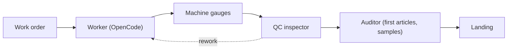
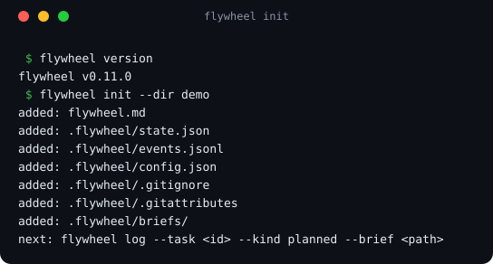
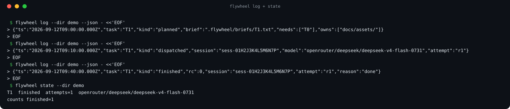
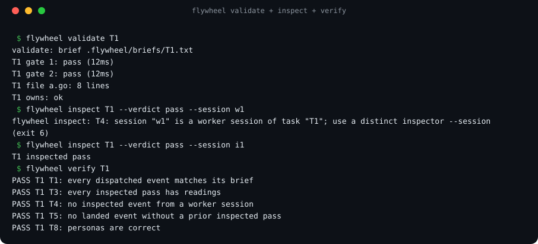
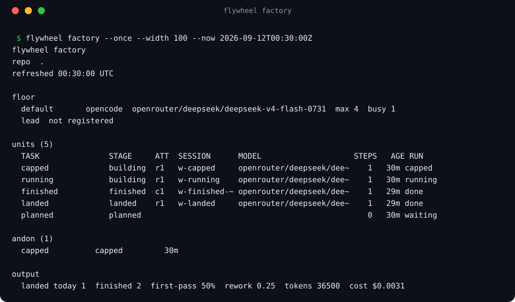

<p align="center">
  <picture>
    <source media="(prefers-color-scheme: dark)" srcset="assets/logo-lockup-dark.svg">
    
  </picture>
</p>

<p align="center"><strong>Own the factory. Rent the agents and the intelligence.</strong></p>

A dark factory for AI coding work. The factory (work orders, gauges, the event log, its
memory) is files you own. Agents and models are rented from any vendor and swapped at will:
cheap disposable agents build, deterministic gauges check every claim, and one frontier
lead makes only the critical calls.

[](https://github.com/suzworx/flywheel/actions)
[](https://github.com/suzworx/flywheel/releases)
[](LICENSE)
[](https://suzworx.github.io/flywheel/)

**Docs and quickstart → [suzworx.github.io/flywheel](https://suzworx.github.io/flywheel/)**

## Built by flywheel

Flywheel is built by flywheel. Sujeet ([@suzworx](https://github.com/suzworx)) runs its
development as a dark factory.

- From v0.3.0 on, flywheel's own features (`flywheel run`, the gauges `validate`, `inspect` and
  `verify`, the `flywheel factory` view), the CLI help and flag fixes, and the factory design
  docs were built as work orders by disposable OpenCode workers on DeepSeek v4 flash (variant
  max).
- Each work order is a brief with `owns:`, `needs:` and `gate:` lines. flywheel's own gauges
  re-run the gates on the exact tree hash and check `owns:`; inspection and `flywheel verify`
  (rules T1, T3, T4, T5 and T8) gate every commit. Workers never commit.
- One frontier lead seat outlines work orders, reviews diffs, runs checks against the built
  binary and signs off. The lead seat changed hands between vendors mid-project and the work
  continued from the files.
- Measured worker cost: the CLI help and flag work took 7 units, 1.7M tokens and $0.33; a
  design doc was drafted, corrected and extended by 5 units for about $0.03; a code unit costs
  $0.03-0.08 and takes 15-29 minutes.

The house rules the workers follow are in [AGENTS.md](AGENTS.md).

## The factory

Flywheel is a factory for AI coding work: a small Go CLI plus agent skills that run a durable
**orchestrator-to-worker loop**. A frontier lead agent plans, briefs and judges; cheap disposable
worker agents (OpenCode) do the reading, writing and testing. The **control plane** dispatches
work and enforces policy; the **data plane** keeps traceability, telemetry and accountability for
every session.

### Roles

| Factory role | Persona | Does | Never |
| --- | --- | --- | --- |
| Plant manager | lead | sets goals and policy, handles escalations, signs off | implements |
| Production planner | planner | turns a spec into work orders (`owns:`/`needs:`/gates) | dispatches or inspects |
| Line supervisor | foreman | runs a line of workers, retries by policy, pulls the cord | plans or implements |
| Line worker | worker (OpenCode) | builds one work order at its own station | plans, inspects, commits |
| Machine gauges | supervisor (CLI, no model) | measures every unit: runs gates, checks `owns:` | judges intent |
| QC inspector | inspector | inspects a unit against its work order | runs gauges or fixes units |
| External auditor | auditor | audits first articles and samples, files nonconformances | works the line |
| Continuous improvement | steward | turns signals and nonconformances into learnings | changes units |
| Owner | operator | installs, assigns roles, sets merge and publish policy | — |

### A unit's path



### Set up, run, watch

- **Set up** — `flywheel init` scaffolds `flywheel.md` plus the `.flywheel/` state files
  (available in v0.2.0). Building the full factory — lines, staffing, and the policy that keeps it
  safe — is [epic #69](https://github.com/suzworx/flywheel/issues/69).
- **Run** — the lead records each work order as an event with `flywheel log --kind planned`;
  [flywheel run #20](https://github.com/suzworx/flywheel/issues/20) dispatches OpenCode workers
  and records their runs automatically (v0.3.0).
- **Watch** — `flywheel state` derives the floor from the event log (available in v0.2.0); the live
  floor is the [flywheel factory #63](https://github.com/suzworx/flywheel/issues/63) view.

Design priorities, in order: **efficiency and consistency**, then **speed, reliability and
recoverability** — the lead spends tokens only where judgment is needed, gauges and telemetry cost
no tokens, and everything replays from the log after any crash.

## Why flywheel

Frontier-quality results at a fraction of frontier cost — measured, not promised: the field run
behind the skills used **99 worker runs across 44 tasks, up to 7 workers in parallel, and about
90 % of all worker input across the field run served from the model cache**.

The goal is to ship with no human in the loop. That is only safe if every step is **recorded** (an
append-only event log), **measured** by the machine (gauges run by the CLI, never self-reported by
an agent), and **audited** by independent checkers. Today the repo has the event log with
`flywheel log` / `flywheel state`, the project config, the worker deny policy, and the persona
skills; the gauges ([#55](https://github.com/suzworx/flywheel/issues/55)) — `validate`, `inspect`
and `verify`, with `inspect` refusing a worker inspecting its own unit
([#24](https://github.com/suzworx/flywheel/issues/24)) — and the run dispatcher
([#20](https://github.com/suzworx/flywheel/issues/20)) shipped in v0.3.0; external audit
([#61](https://github.com/suzworx/flywheel/issues/61)) is still planned.

Any agent can lead. The loop lives in repository files and shell commands, not inside any one
vendor's session, so a new head — Claude Code, Codex, OpenCode, or a human — reads the same state
and continues the same work.

## How it works

The loop is five steps: **Plan → Brief → Dispatch → Review → Correct-or-land**. Steps 1, 4 and 5
are lead judgment; 2 and 3 are mechanical.

**Repo is the session.** All state lives in the repository as files — the event log, work orders,
worker plans, reports — not inside any vendor session. That is what makes agents swappable and the
loop crash-safe: run out of tokens, hit a host timeout, lose a watcher; the next head reads the
same files and continues, and nothing is lost.

Two design docs define the factory:

- [Autonomous shipping: the flywheel factory](docs/design/autonomous-shipping.md) — the factory
  model, the required events, the poka-yoke transition rules, and the enforcement layers.
- [Flywheel at scale](docs/design/flywheel-at-scale.md) — personas, many parallel workers,
  per-task worktrees and landing, native feedback, and offline use.

## See it

Real transcripts from this branch, rendered from actual CLI output.

*`flywheel init` scaffolds `flywheel.md` plus the `.flywheel/` state files.*



*A task's life is recorded in the append-only event log; state is derived from the log, not stored
alongside it.*



*Real output: the worker's tree-rewriting git commands are refused even under `--auto`; read-only
git still works.*


*The gauges measure the tree; inspect refuses to pass a unit that has no supervisor readings on record.*



*Real output: the factory floor at a fixed instant, showing landed, running, finished-awaiting-inspection, capped and planned units.*



### Measure, don't trust

`flywheel validate` runs a task's gates and checks its `owns` boundary, recording supervisor readings; `flywheel inspect` only passes a unit whose readings are on record (and refuses a worker session's verdict); `flywheel verify` checks every poka-yoke rule. `validate` exits 5 when a gate fails or a change sits outside `owns`, and an `inspect` refusal exits 6.

### Worker adapters

`flywheel run` dispatches through one of three adapters: `opencode`, `claude`, or the offline
`sim` adapter used by tests and this repo's own demo. Each worker in `.flywheel/config.json` names
its adapter; `flywheel run --worker <name>` picks between several configured workers, so one
factory can be all-OpenCode, all-Claude, or a mix. The `opencode` adapter is the original,
most-used path. The `claude` adapter (issue [#49](https://github.com/suzworx/flywheel/issues/49))
has been exercised against the live CLI: `flywheel run` dispatches it, parses the
`--output-format stream-json` stream, captures the session id and the assistant text, and
records the finish. That run did not get past authentication in the environment where it
was tried, so a productive run — tool calls, file edits, token and cost accounting — is
still unverified. Try one real run in your own environment before depending on it.

`flywheel run` exits 0 on a clean finish, exit 3 on a silent start (no output before the start
timeout), 4 when the worker exited nonzero, capped, or hit a provider error, and exit 7 on a
mid-stream stall (no run-file line for the stall timeout while the process is still alive).

## Quickstart

1. **Get the CLI.** Download **flywheel-v0.2.0-\<os\>-\<arch\>.zip** from the
   [Releases page](https://github.com/suzworx/flywheel/releases) — Windows binaries ship as
   `flywheel-v0.2.0-windows-amd64.exe.zip` — plus `checksums.txt`. Or build from source:

   ```bash
   git clone https://github.com/suzworx/flywheel.git && cd flywheel
   mkdir -p bin && go build -o bin/flywheel ./cmd/flywheel
   ```

   `go install github.com/suzworx/flywheel/cmd/flywheel@latest` is not supported yet: go.mod
   declares the module as `flywheel`, not `github.com/suzworx/flywheel`, so there is no
   installable module path ([#74](https://github.com/suzworx/flywheel/issues/74)).

2. **Install the skills** into your agent — one per skill folder below:

   ```bash
   npx skills add suzworx/flywheel --skill flywheel
   npx skills add suzworx/flywheel --skill flywheel-worker
   # ... flywheel-planner, flywheel-foreman, flywheel-inspector,
   #     flywheel-auditor, flywheel-steward, flywheel-operator
   ```

3. **Scaffold a project:**

   ```bash
   flywheel init --dir demo
   ```

4. **Run.** Ask your lead agent to load the `flywheel` skill and drive the loop: plan → brief →
   dispatch → review → correct-or-land. The lead writes precise bounded briefs, dispatches OpenCode
   workers, and judges the evidence. `flywheel run` records each dispatch automatically; the
   lead records the other events (reviews, landings) with `flywheel log`.

### Upgrading

- Swap the binary; renaming the old executable is safe while a unit runs.
- Keep symlinked skill installs rather than copies — the skills installer can replace symlinks
  with copies.
- Commit `skills-lock.json`, or any tracked file the skills installer touched, before the next
  `flywheel validate`, because files the lead changes after a unit's dispatch count against that
  unit's owns check.
- Run `flywheel status` afterwards.

## CLI

`flywheel help <command>` (or `<command> -h`) prints any command's flags.

| Command | Status | What it does |
| --- | --- | --- |
| `flywheel version` | available (v0.2.0) | Print the flywheel version. |
| `flywheel init` | available (v0.2.0) | Scaffold `flywheel.md` + `.flywheel/state.json` + `.flywheel/events.jsonl` + `.flywheel/briefs/`. |
| `flywheel log` | available (v0.2.0) | Append an event to `.flywheel/events.jsonl` and re-derive state. |
| `flywheel state` | available (v0.2.0) | Derive and print state from the event log. |
| `flywheel config` | available | Read, validate and `set` `.flywheel/config.json` (config package merged). |
| `flywheel doctor` | available | Probe every configured model and classify its availability (exit 0/1). |
| `flywheel run` | available | Dispatch a worker (adapter and model from `.flywheel/config.json`, or `--worker <name>`) and capture the run. |
| `flywheel status` | available ([#21](https://github.com/suzworx/flywheel/issues/21)) | Summarize the factory: task counts, live/stale attempts, last event and progress, andon. |
| `flywheel handoff` | available | Print the handoff summary for a new head: in-flight tasks (with session and model), blockers, next ready tasks, and the default worker model; `--stdout` prints it, otherwise it goes into `flywheel.md`. |
| `flywheel cost` | available ([#29](https://github.com/suzworx/flywheel/issues/29)) | Sum finished events' tokens and cost per task and per model. |
| `flywheel stats` | available ([#41](https://github.com/suzworx/flywheel/issues/41)) | The factory's own numbers: first-pass rate, corrections per task, finish reasons, mean attempt time, cost per landed task. |
| `flywheel next` | available | Print the reconciler's next actions read-only: lost attempts, inspection requests, blocks, waits and dispatches. |
| `flywheel watch` | planned ([#22](https://github.com/suzworx/flywheel/issues/22)) | Watch the line, one readable line per transition. |
| `flywheel validate` | available | Machine gauges: run a task's gate: lines on the exact tree and check owns (exit 0/5). |
| `flywheel lint` | available | Check a brief for problems: owns, gate, goal, report contract, owns paths (exit 0/1). |
| `flywheel supervise` | planned ([#55](https://github.com/suzworx/flywheel/issues/55)) | Machine gauges: measure finished units, run the gates. |
| `flywheel verify` | available | Check the event log against the transition rules T1, T3, T4, T5, T8 (exit 0/6). |
| `flywheel inspect` | available | Inspection verdict, refused unless the gauges' readings cover the tree as it is now (T3/T4/T8; exit 6). |
| `flywheel review <task> --verdict pass\|correct\|reject --session <session>` | available ([#24](https://github.com/suzworx/flywheel/issues/24)) | Re-run a task's gates and owns check on an isolated copy of the tree, so another in-flight worker's half-written files can't skew the reading; refused (exit 6) for a bad verdict, a worker's session, a changed path outside owns, or a failing gate. |
| `flywheel audit` | planned ([#61](https://github.com/suzworx/flywheel/issues/61)) | External audit of first articles and samples. |
| `flywheel land <task> --commit <sha>` | available | Record a landing for a passed task; refused without a passing inspection (exit 6). |
| `flywheel factory` | available | Live terminal dashboard of the floor; bare `flywheel` opens it ([#63](https://github.com/suzworx/flywheel/issues/63)). |
| `flywheel controller` | available | The controller loop: one tick at a time (single-process lock), marking lost attempts and blocking tasks whose needs were scrapped. |
| `flywheel staff` | available | Register the lead (or another role) on the floor. |
| `flywheel goal` | available | Manage the factory's goals: add, list, show and set (add, list, show, set). |
| `flywheel claim <task>` | available ([#165](https://github.com/suzworx/flywheel/issues/165)) | Claim a task for a session so another lead sharing the tree knows it is driven; refused (exit 6) for a live claim held elsewhere unless `--force`. |
| `flywheel release <task>` | available ([#165](https://github.com/suzworx/flywheel/issues/165)) | Release a claimed task; refused (exit 6) for a live claim held elsewhere unless `--force`. |
| `flywheel claims` | available ([#165](https://github.com/suzworx/flywheel/issues/165)) | List every claim: task, session, note, age, live or expired. |
| `flywheel explain`, `flywheel context` | planned ([#58](https://github.com/suzworx/flywheel/issues/58)) | A task's traveler; the factory state sized for a joining agent. |
| `flywheel trace <session> [--dir DIR]` | available ([#62](https://github.com/suzworx/flywheel/issues/62)) | Everything one session did, across tasks. |
| `flywheel feedback` | available (add/list/dismiss; export and submit land with [#40](https://github.com/suzworx/flywheel/issues/40)) | Turn signals into learnings: `add`, list, `dismiss`, and a generated `learnings.md`. |
| `flywheel upgrade` | available ([#201](https://github.com/suzworx/flywheel/issues/201)) | Self-update to a release with checksum verification: `--check` prints current and latest and whether an upgrade is available; otherwise download, verify the SHA-256 and install atomically. |

## Skills

Each role ships as a skill folder any agent can load:

- [`flywheel`](skills/flywheel/SKILL.md) — the lead: drive the loop, judge evidence, never implement.
- [`flywheel-planner`](skills/flywheel-planner/SKILL.md) — write work orders; never dispatch.
- [`flywheel-foreman`](skills/flywheel-foreman/SKILL.md) — run a line of OpenCode workers; retry by policy.
- [`flywheel-worker`](skills/flywheel-worker/SKILL.md) — execute one brief, run its gates, report evidence.
- [`flywheel-inspector`](skills/flywheel-inspector/SKILL.md) — QC verdicts: pass, rework, scrap, escalate.
- [`flywheel-auditor`](skills/flywheel-auditor/SKILL.md) — independent audit of first articles and samples.
- [`flywheel-steward`](skills/flywheel-steward/SKILL.md) — turn signals and nonconformances into learnings.
- [`flywheel-operator`](skills/flywheel-operator/SKILL.md) — install, configure, assign personas.

## Roadmap

Three epics drive the factory:

- [#10](https://github.com/suzworx/flywheel/issues/10) — the factory core: the append-only event
  log, project config, and built-in feedback.
- [#35](https://github.com/suzworx/flywheel/issues/35) — flywheel at scale: native feedback,
  personas, many workers, offline.
- [#51](https://github.com/suzworx/flywheel/issues/51) — autonomous shipping: a unit's full path
  from work order to landing, with no human in the loop.

## CI/CD

- **`ci`** runs on every PR and push to main: build, vet and tests on Linux, Windows and macOS,
  gofmt, a cross-compile of all release targets, a JSON parse check, and a PR-title check.
- **`release`** keeps one release PR open; merging it tags `vX.Y.Z`, publishes the GitHub release,
  and attaches binaries for five platforms plus `checksums.txt`.
- Bump rules, highest wins: `type!` or `BREAKING CHANGE:` → major (minor while major is 0);
  `feat` → minor; `fix`/`perf`/`docs`/`refactor`/`revert` → patch; anything else → no release.
  PRs are squash-merged, so the PR title decides the bump. The release PR is opened by GitHub
  Actions, so CI checks do not run on it (a `GITHUB_TOKEN` limitation).

## Learnings

Consumer repos keep their learnings in `.flywheel/learnings.md` — the log of what hurt, so friction
becomes spec (flywheel will generate it from signals,
[#38](https://github.com/suzworx/flywheel/issues/38)). This repo gitignores that file and tracks
its own learnings as issues under [epic #10](https://github.com/suzworx/flywheel/issues/10).

## License

MIT — see [LICENSE](LICENSE).