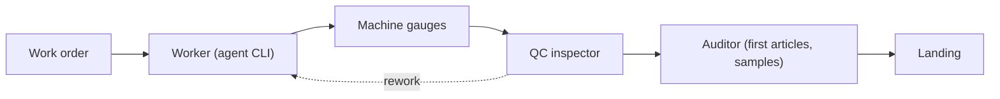

<p align="center">
  <picture>
    <source media="(prefers-color-scheme: dark)" srcset="assets/logo-lockup-dark.svg">
    
  </picture>
</p>

<p align="center"><strong>Own the factory. Rent the agents and the intelligence.</strong></p>

[](https://github.com/suzworx/flywheel/actions)
[](https://github.com/suzworx/flywheel/releases)
[](LICENSE)
[](https://suzworx.github.io/flywheel/)

flywheel is a dark factory for AI coding work: a small Go CLI plus agent skills. The factory
(work orders, gauges, the event log, its memory) is files you own; agents and models are rented
from any vendor and swapped at will. Cheap disposable agents build, deterministic gauges re-measure
every claim, and one frontier lead makes only the critical calls. It is for engineers who run
coding agents in parallel and want every change measured, recorded and recoverable.

## Install

Download **flywheel-\<version\>-\<os\>-\<arch\>.zip** from the
[latest release](https://github.com/suzworx/flywheel/releases/latest) (Windows binaries ship as
`flywheel-<version>-windows-amd64.exe.zip`) plus `checksums.txt`, verify the SHA-256, and put the
binary on PATH renamed to `flywheel` (the archive holds a single binary named after the release).
Or install with Go (the module is `github.com/suzworx/flywheel`; the binary lands in
`$(go env GOPATH)/bin`), or build from source:

```bash
go install github.com/suzworx/flywheel/cmd/flywheel@latest
# or
git clone https://github.com/suzworx/flywheel.git && cd flywheel
mkdir -p bin && go build -o bin/flywheel ./cmd/flywheel
```

`flywheel upgrade --check` tells you whether a newer release exists and `flywheel upgrade`
installs it, checksum-verified. It refuses (exit 6) while a run's lease is live in `--dir`
(default `.`), since swapping the binary can crash that run; wait for it (`flywheel wait`) or pass
`--force`. Then install the skills into your agent, one per skill folder ([Skills](#skills)):

```bash
npx skills add suzworx/flywheel --skill flywheel
npx skills add suzworx/flywheel --skill flywheel-worker
# ... flywheel-planner, flywheel-foreman, flywheel-inspector, flywheel-reviewer,
#     flywheel-auditor, flywheel-steward, flywheel-operator
```

## 60-second tour

Offline, no API key: the `sim` adapter replays a recorded worker run instead of calling a model.
In an empty git repository:

```bash
flywheel init
flywheel config set workers.default.adapter sim
flywheel config set workers.default.model .flywheel/sim.jsonl
cat > .flywheel/sim.jsonl <<'EOF'
{"type":"text","sessionID":"ses_demo","part":{"type":"text","text":"Wrote hello.txt. Gate passes."}}
{"type":"step_finish","sessionID":"ses_demo","part":{"type":"step_finish","reason":"stop","tokens":{"input":120,"output":40},"cost":0.001}}
EOF
cat > .flywheel/briefs/hello.txt <<'EOF'
owns: hello.txt (new)
needs: none
gate: grep -q "Hello from flywheel" hello.txt

# TASK: hello — write a greeting file

Write hello.txt containing the line "Hello from flywheel". At most one write per response.

## Checks

Report the commands you ran and their real exit status.
EOF
flywheel lint .flywheel/briefs/hello.txt          # 0 problems, 0 warnings
flywheel log --task hello --kind planned --brief .flywheel/briefs/hello.txt
flywheel run hello
```

```text
hello r1 dispatched sim .flywheel/sim.jsonl
hello r1 finished rc=0 reason=stop model=.flywheel/sim.jsonl steps=1 tokens=160 cost=$0.0010
hello r1 finished without writing a file
hello r1 never ran gate(s) 1
```

The worker says the gate passes. The gauges measure instead of believing it:

```text
$ flywheel validate hello                                  # exit 5
hello gate 1: failed (rc=2)
hello note: the worker never ran gate(s) 1 itself; its report's claims about them are unmeasured
hello owns: ok
$ flywheel inspect hello --verdict pass --session lead-1   # exit 6
flywheel inspect: T3: no passing supervisor validated reading for gate 1 on tree 4b825dc642cb6eb9a060e54bf8d69288fbee4904 after the latest finished event; run: flywheel validate hello
$ echo "Hello from flywheel" > hello.txt
$ flywheel validate hello                                  # exit 0
hello gate 1: pass (399ms)
hello owns: ok
$ flywheel inspect hello --verdict pass --session lead-1   # exit 0
hello inspected pass
$ flywheel factory --once
units (1)
  TASK               STAGE     ATT  SESSION      MODEL                    STEPS   AGE RUN
  hello              passed    r1                .flywheel/sim.jsonl         1    0s done
```

With a real worker (`claude`, `codex` or `opencode`) the file is written by the agent; see the
[Quickstart](docs/quickstart.md) for the full path to a landed unit.

## Docs

The site renders all of these: **[suzworx.github.io/flywheel](https://suzworx.github.io/flywheel/)**.

- [Quickstart](docs/quickstart.md) — from a binary to one landed unit through the loop.
- [Concepts](docs/concepts.md) — work orders, `owns:`, gates, the event log, the poka-yoke rules.
- [Protocol](docs/PROTOCOL.md) — the normative contract: every event kind, rule and exit code.
- [Features](docs/features.md) — the long walkthrough: adapters, routing, limits, recover,
  worktrees, the review agent and panel, ship.
- [HUMAN.md](HUMAN.md) — leading the agents yourself from the terminal.
- Design docs:
  - [Autonomous shipping](docs/design/autonomous-shipping.md) — the factory model, the required
    events, the poka-yoke transition rules, and the enforcement layers.
  - [Flywheel at scale](docs/design/flywheel-at-scale.md) — personas, many parallel workers,
    per-task worktrees and landing, native feedback, and offline use.
  - [Factory as files](docs/design/factory-as-files.md)
  - Runtime: [architecture](docs/design/runtime/01-architecture.md),
    [gaps](docs/design/runtime/02-gaps.md), [design](docs/design/runtime/03-design.md),
    [plan](docs/design/runtime/04-plan.md)
- [Review calibration](docs/calibration/README.md) — the review agent measured against past PRs.
- [Skills](#skills) — one skill folder per factory role; [AGENTS.md](AGENTS.md) holds the house rules.

## Built by flywheel

Flywheel is built by flywheel. Sujeet ([@suzworx](https://github.com/suzworx)) runs its
development as a dark factory.

- From v0.3.0 on, flywheel's own features (`flywheel run`, the gauges `validate`, `inspect` and
  `verify`, the `flywheel factory` view), the CLI help and flag fixes, and the factory design
  docs were built as work orders by disposable OpenCode workers on DeepSeek v4 flash (variant
  max).
- Since September 2026 the workers are `claude-haiku-4-5` agents dispatched through the `claude`
  adapter, and the lead is Claude. Across 30 units (33 attempts) a unit cost a median $0.55
  (range $0.27-1.63) and took a median 14 minutes; every attempt finished cleanly, yet the
  lead's review and an independent PR reviewer still caught defects in most units, which is
  why every claim is re-measured rather than trusted.
- Each work order is a brief with `owns:`, `needs:` and `gate:` lines. flywheel's own gauges
  re-run the gates on the exact tree hash and check `owns:`; inspection and `flywheel verify`
  (rules T1, T3, T4, T5 and T8) gate every commit. Workers never commit.
- One frontier lead seat outlines work orders, reviews diffs, runs checks against the built
  binary and signs off. The lead seat changed hands between vendors mid-project and the work
  continued from the files.
- Measured worker cost: the CLI help and flag work took 7 units, 1.7M tokens and $0.33; a
  design doc was drafted, corrected and extended by 5 units for about $0.03; a code unit costs
  $0.03-0.08 and takes 15-29 minutes.

The house rules the workers follow are in [AGENTS.md](AGENTS.md).

## The factory

Flywheel is a factory for AI coding work: a small Go CLI plus agent skills that run a durable
**orchestrator-to-worker loop**. A frontier lead agent plans, briefs and judges; cheap disposable
worker agents (Claude Code, Codex or OpenCode) do the reading, writing and testing. The **control plane** dispatches
work and enforces policy; the **data plane** keeps traceability, telemetry and accountability for
every session.

### Roles

| Factory role | Persona | Does | Never |
| --- | --- | --- | --- |
| Plant manager | lead | sets goals and policy, handles escalations, signs off | implements |
| Production planner | planner | turns a spec into work orders (`owns:`/`needs:`/gates) | dispatches or inspects |
| Line supervisor | foreman | runs a line of workers, retries by policy, pulls the cord | plans or implements |
| Line worker | worker (any agent CLI) | builds one work order at its own station | plans, inspects, commits |
| Machine gauges | supervisor (CLI, no model) | measures every unit: runs gates, checks `owns:` | judges intent |
| QC inspector | inspector | inspects a unit against its work order | runs gauges or fixes units |
| External auditor | auditor | audits first articles and samples, files nonconformances | works the line |
| Continuous improvement | steward | turns signals and nonconformances into learnings | changes units |
| Owner | operator | installs, assigns roles, sets merge and publish policy | — |

### A unit's path


```mermaid
flowchart LR
    WO["Work order"] --> W["Worker (agent CLI)"]
    W --> G["Machine gauges"]
    G --> I["QC inspector"]
    I --> A["Auditor (first articles, samples)"]
    A --> L["Landing"]
    I -. "rework" .-> W
```

### Set up, run, watch

- **Set up** — `flywheel init` scaffolds `flywheel.md` plus the `.flywheel/` state files and ends
  with a factory summary: worker lines, limits, audit policy and the enforcement layers installed
  (with the command for each missing one). The full factory is
  [epic #69](https://github.com/suzworx/flywheel/issues/69).
- **Run** — the lead records each work order with `flywheel log --kind planned`; `flywheel run`
  dispatches it through the `claude`, `codex`, `opencode` or `sim` adapter and records the run;
  `--worktree` builds each unit in its own `.flywheel/worktrees/<task>` on branch `fw/<task>`.
- **Watch** — `flywheel state` derives the floor from the log, `flywheel factory` opens an
  interactive k9s-style view of it, `flywheel watch` streams every event as one line, and
  `flywheel wait <task>...` blocks until the named units finish.

The details (bases, `--notify`, the TREE column, withdrawing a plan) are in
[docs/features.md](docs/features.md#dispatch-watch-and-wait).
- **Set up** — `flywheel init` scaffolds `flywheel.md` plus the `.flywheel/` state files
  (available in v0.2.0). It ends with a factory summary — the worker lines, limits, audit policy, which enforcement layers are installed (and the command for each missing one) and how to view the floor. Building the full factory — lines, staffing, and the policy that keeps it
  safe — is [epic #69](https://github.com/suzworx/flywheel/issues/69).
- **Run** — the lead records each work order as an event with `flywheel log --kind planned`;
  `flywheel run` dispatches it to a worker through the `claude`, `codex` or `opencode` adapter and
  records the run automatically. For parallel units `flywheel run --worktree` is the default: each
  unit builds in its own `.flywheel/worktrees/<task>` on branch `fw/<task>`, against the main ledger.
  `--worktree --base REF` branches a new `fw/<task>` from REF, without checking REF out. Without
  `--base` a new `fw/<task>` starts from `origin/<integration.branch>` (else the local branch) when
  `integration.branch` is set, and is refused when neither resolves; otherwise from the main
  checkout's HEAD, with a warning when HEAD carries commits `origin/main` lacks (#550). The
  `dispatched` event's `base` records the commit the unit branched from.
  `flywheel run --workdir PATH` runs the worker in an existing tree the lead prepared (a merge in
  progress, say) while events still go to `--dir`'s ledger; it is refused (exit 6) with `--worktree`
  or `--base`, or when PATH is not a git working tree of the same repository.
  `flywheel run --session ID` (default `$FLYWHEEL_SESSION`) records the dispatching lead session as
  the dispatched event's `lead`, so leads sharing one ledger can tell their units apart.
- **Watch** — `flywheel state` derives the floor from the event log; `flywheel factory` opens an interactive, k9s-style view of the floor (`:units` `:workers` `:andon` `:events` `:lines` to switch, `/` to filter, enter to explain a unit, `l` for its log, `?` for help, `q` to quit; `--plain` keeps the plain redraw), and `flywheel watch` streams every event as one readable line.
  When any unit runs in a worktree, the plain floor's (`flywheel factory --plain`) units table adds a TREE column with that worktree and its base commit (`CP-A@abcdef1`), and the `--json` view carries `workdir` and `base`.
- **Know when a unit finishes** — never background a dispatch with a bare `&` and hope to notice:
  `flywheel wait <task>... [--timeout D]` blocks until each named task finishes its current (or
  first) attempt, printing `<task> <attempt> finished reason=<r>` as each lands (exit 0 all clean,
  4 any unclean, 8 timeout), and `flywheel run <task> --notify CMD` runs `CMD` through the shell
  when the run returns on any path, with `FLYWHEEL_FINISHED="<task> <attempt> reason=<r> exit=<code>"`
  in its environment; a failing notify only warns.

Design priorities, in order: **efficiency and consistency**, then **speed, reliability and
recoverability** — the lead spends tokens only where judgment is needed, gauges and telemetry cost
no tokens, and everything replays from the log after any crash.

## Why flywheel

Frontier-quality results at a fraction of frontier cost — measured, not promised: the field run
behind the skills used **99 worker runs across 44 tasks, up to 7 workers in parallel, and about
90 % of all worker input across the field run served from the model cache**. `max_parallel` caps
concurrent *workers*, not concurrent *gates*: units whose `gate:` lines name the same expensive
command serialise on it, and the contention manufactures false findings (phantom timeouts) that
read as code defects — `flywheel run` prints a shared-gate warning at dispatch whenever an
in-flight unit declares the same gate line.

The goal is to ship with no human in the loop. That is only safe if every step is **recorded** (an
append-only event log), **measured** by the machine (gauges run by the CLI, never self-reported by
an agent), and **audited** by independent checkers. Today all three are in place: the append-only
event log is hash-chained, so an edited record, or one removed from the middle, is detected
(`flywheel verify --log`; cutting records off the end needs an outside anchor such as a pushed
commit); the gauges `validate`, `inspect` and `verify` measure
every unit, with `flywheel supervise` measuring each finished unit nobody has measured yet; and
`flywheel audit` re-measures a unit in a clean copy from a session that neither built nor inspected
it, selecting first articles and seeded samples
([#61](https://github.com/suzworx/flywheel/issues/61)). Enforcement sits in more than one layer:
the CLI refuses illegal transitions (exit 6), an agent Stop hook runs `flywheel gate`, and git
hooks check every commit and push (`flywheel init --git-hooks`); whatever the worker's adapter,
`flywheel run` flags an attempt that moved HEAD, switched branch or stashed with a `git-write`
signal, which blocks landing until the lead triages it (it compares the attempt's end points, so a
push or a write undone before exit needs the command-level guard,
[#319](https://github.com/suzworx/flywheel/issues/319)). That guard is in place: `flywheel run`
puts a `git` shim first on the worker's PATH that passes only read-only commands (status, diff, log,
show, grep, blame, rev-parse, … and the listing forms of branch, tag, config, stash) to the real
git and refuses everything else — commit, push, stash, reset, checkout, add, rm, clean, an alias —
in the unit's repository (git in a test's own temporary repository runs normally, and flywheel's
temporary-index tree hashing is allowed), and a run whose guard cannot be installed is refused; a worker that calls git by an absolute path
bypasses it, and the end-point check still applies.

Any agent can lead. The loop lives in repository files and shell commands, not inside any one
vendor's session, so a new head — Claude Code, Codex, OpenCode, or a human — reads the same state
and continues the same work.

## How it works

The loop is five steps: **Plan → Brief → Dispatch → Review → Correct-or-land**. Steps 1, 4 and 5
are lead judgment; 2 and 3 are mechanical.

**Repo is the session.** All state lives in the repository as files — the event log, work orders,
worker plans, reports — not inside any vendor session. That is what makes agents swappable and the
loop crash-safe: run out of tokens, hit a host timeout, lose a watcher; the next head reads the
same files and continues, and nothing is lost.

1. **Plan** — the lead turns a goal into work orders: a brief with `owns:`, `needs:` and `gate:`
   lines (`flywheel brief --from-issue N` writes one from a tracker issue), recorded `planned`.
2. **Brief** — `flywheel lint` checks each brief before it is dispatched.
3. **Dispatch** — `flywheel run` sends it to a worker, in its own worktree, and records the run.
4. **Review** — the gauges (`validate`, `inspect`, `verify`) re-measure every claim; the review
   agent and its panel read the diff (`flywheel review --agent`).
5. **Correct or land** — a correction delta goes back to the worker's session, or the unit lands
   (`flywheel land --merge`) and ships (`flywheel ship`).

`flywheel recover` starts every lead session: it checks the ledger against the world and prints
one next action per unit. Adapters, routing, budgets and rate limits, the controller, checkpoints,
worktree setup, the review panel and more, with screenshots, are in
**[docs/features.md](docs/features.md)**.

## Drive it with a lead agent

Ask your lead agent to load the `flywheel` skill and drive the loop: plan → brief → dispatch →
review → correct-or-land. The lead writes precise bounded briefs, dispatches workers through the
configured adapter, and judges the evidence. `flywheel run` records each dispatch automatically;
the lead records the other events (reviews, landings) with `flywheel log` and the commands below.
Leading the agents yourself from the terminal instead? [HUMAN.md](HUMAN.md) walks you through it.

## Upgrading

- Swap the binary; renaming the old executable is safe while a unit runs.
- Keep symlinked skill installs rather than copies — the skills installer can replace symlinks
  with copies.
- Commit `skills-lock.json`, or any tracked file the skills installer touched, before the next
  `flywheel validate`, because files the lead changes after a unit's dispatch count against that
  unit's owns check. A lead-side edit made after dispatch can be declared afterwards with
  `flywheel claim-edit --paths <p1,p2> --session <session>`, so the owns check attributes it
  instead of refusing the unit; the claim is bound to the content it declared, so a later change
  to the same path is outside again (issue #258). Another session's edit in a sibling worktree is
  claimed the same way with `--worktree <dir>`, which hashes the paths in that worktree (issue #362).
- Run `flywheel status` afterwards.

## CLI

One row per command; `flywheel help <command>` (or `<command> -h`) prints its usage and every flag,
and exit codes are in [PROTOCOL.md](docs/PROTOCOL.md). Bare `flywheel` opens the factory view.

| Command | What it does |
| --- | --- |
| `flywheel init` | Scaffold `flywheel.md` and `.flywheel/`; `--hooks` agent session hooks, `--git-hooks` commit-msg and pre-push hooks, `--ci` the `flywheel-audit` workflow, `--local MODEL` an offline worker. |
| `flywheel config <get\|set\|show\|validate>` | Read, set and validate `.flywheel/config.json`, e.g. `flywheel config set integration.branch main2`; an unknown key lists every settable key. |
| `flywheel doctor [--worker NAME] [--record]` | Probe every configured model and classify its availability (exit 0/1); warns when the ledger is untracked or lacks `merge=union`, and names the integration branch. |
| `flywheel version` | Print the flywheel version. |
| `flywheel upgrade [--check] [--to VERSION] [--force]` | Self-update to a release, checksum-verified; refuses (exit 6) while a run's lease is live unless `--force`. |
| `flywheel brief <task> --from-issue N --owns a,b` | Turn a tracker issue into a linted brief at `.flywheel/briefs/<task>.txt` and record it `planned` with the issue number. |
| `flywheel lint <brief> [--probe]` | Check a brief for problems and warnings (problems exit 1); `--probe` runs each `gate:` once on the base tree before dispatch. |
| `flywheel log --task T --kind K` | Append an event and re-derive state: `planned`, `withdrawn` (refused while an attempt is live, rule W1), `amended`, `rebased`, `note`, …; `--shard` switches to per-task shards. |
| `flywheel goal` | Manage the factory's goals: add, list, show and set. |
| `flywheel run <task>` | Dispatch a worker (`--worker`, `--model`, `--worktree [--base REF]`, `--delta`, `--resume`, `--notify CMD`) and record the run; exit 0 clean, 3 silent start, 4 unclean, 7 stall. |
| `flywheel wait <task>... [--timeout D]` | Block until each named task finishes its current attempt; exit 0 all clean, 4 any unclean, 8 timeout. |
| `flywheel validate <task> [--workdir PATH] [--carry PATH]... [--live]` | Machine gauges: run a task's gates on the exact tree and check owns (exit 0/5); `--carry` copies a path in first, `--live` adds the `live-gate:` lines. |
| `flywheel supervise [--once] [--resume-limited]` | Validate every finished unit nobody has measured yet (exit 5 if any fails); `--resume-limited` resumes rate-limited units once their reset passes. Never inspects or lands. |
| `flywheel inspect <task> --verdict V --session S` | Record an inspection verdict, refused (exit 6) unless the gauges' readings cover the current tree (or `--commit`'s). |
| `flywheel verify [<task>...] [--all] [--log]` | Check the log against the rules T1, T3, T4, T5, T8, R1, P1 and W1 (exit 0/6); `--log` also checks the hash chain. |
| `flywheel attest <task> --commit SHA --evidence URL --session S` | Record gate readings an external run (CI on the PR) measured on a merged commit, marked `source: external`. |
| `flywheel review <task> --verdict V --session S` | Re-run a task's gates and owns check on an isolated copy of the tree and record the reviewer's verdict. |
| `flywheel review <task> --agent --session S [--fix] [--panel]` | Run the review agent (or `--panel`, one persona per dimension); `--fix` loops findings back to the worker; `--dismiss ID --note` closes one. Exit 0 pass, 1 correct. |
| `flywheel review --group <goal\|tasks:a,b> --agent --session S [--base REF]` | Merge a group's units onto `--base` (default `integration.branch`, else `main`), run `review.group_gates` and review the combined diff. |
| `flywheel review calibrate --cases FILE --session S [--sample N] [--panel [dims]]` | Measure the review agent's recall against defects an external reviewer found on past PRs ([docs/calibration](docs/calibration/README.md)). |
| `flywheel audit (<task>\|--sample R\|--first-article\|--wave\|--release V) --session S` | Independent audit: re-run a unit's gates in a clean copy and check its record (exit 0/5), or audit a published release (exit 8 inconclusive). |
| `flywheel land <task> [--merge [--onto BRANCH]] [--commit SHA] [--note TEXT]` | Land a passed unit: `--merge` rebases its worktree onto the integration branch, re-runs gates and fast-forwards; refused without a passing inspection (T5). |
| `flywheel land <task> --commit SHA --by-lead --reason TEXT` | Record a unit the lead implemented itself; `--exception TEXT --session S` lands a hand-verified unit, `--allow-untriaged REASON` past untriaged signals (T9). |
| `flywheel ship <task> [--integration BRANCH]` | Local shipping steps: preflight, commit leftovers, merge the integration branch into `fw/<task>`, re-run gates; one `shipped` event each, resumable. |
| `flywheel rebase <task> [--onto REF]` | Move a `stacked` unit's `fw/<task>` onto the integration branch and record the new base (exit 1 on conflicts, aborted). |
| `flywheel recover [--apply] [--json]` | After a crash or a new session: integrity plus every unit's world against the ledger, with one next action and command each; `--apply` runs only the safe ones. |
| `flywheel checkpoint list\|diff\|restore\|drop` | The snapshots of interrupted attempts at `refs/flywheel/checkpoints/<task>/<attempt>`. |
| `flywheel ledger backup <path>` | Write a verified, point-in-time copy of `.flywheel/` with a sha256 manifest; the ledger itself is committed to git. |
| `flywheel state` | Derive and print state from the event log. |
| `flywheel status [--health]` | Summarize the factory: task counts, live and stale attempts, andon; `--health` prints the controller's latest health record (exit 1 when stale). |
| `flywheel factory [--once\|--json\|--plain]` | Interactive, k9s-style view of the floor; `--plain` keeps the plain redraw, `--once` renders once. |
| `flywheel watch [--once] [--last N]` | A readable live stream of the log, one line per event. Read-only. |
| `flywheel next` | Print the reconciler's next actions read-only: lost attempts, inspections, blocks, waits, dispatches, or HOLD on a spent budget, open breaker or rate limit. |
| `flywheel controller [--once] [--health-every D]` | The controller loop: mark lost attempts, block scrapped needs, resume rate-limited units, record `health` events. |
| `flywheel explain <task>` | One task's whole story from the ledger as Markdown or JSON. Read-only. |
| `flywheel trace <session>` | Everything one session did, across tasks. |
| `flywheel context [--role R]` | A compact pack of the factory's state for a joining agent. Read-only. |
| `flywheel handoff [--stdout]` | The handoff summary for a new head: in-flight tasks, blockers, next ready tasks, untriaged signals. |
| `flywheel gate` | Exit 6 while work is left unjudged (finished units not inspected, untriaged signals); for agent Stop hooks. |
| `flywheel staff --role R --session S` | Register the lead (or another role) on the floor. |
| `flywheel claim <task>` | Claim a task for a session so another lead sharing the tree knows it is driven. |
| `flywheel release <task>` | Release a claimed task; refused (exit 6) for a live claim held elsewhere unless `--force`. |
| `flywheel claims` | List every claim: task, session, note, age, live or expired. |
| `flywheel claim-edit --paths P1,P2 --session S` | Declare a lead's own edit made after a unit's dispatch so the owns check attributes it; bound to the content declared. |
| `flywheel cost` | Sum finished events' tokens and cost per task and per model. |
| `flywheel stats [--by model [--kind]]` | The factory's own numbers: first-pass rate, corrections, cost per landed task, review numbers; `--by model` adds a per-model scoreboard. |
| `flywheel feedback [add\|dismiss\|regen\|export\|submit]` | Turn signals into learnings in `learnings.md`; `regen` rebuilds it from the log, `export` and `submit` send a sanitised report upstream, consent-first. |
| Command | Status | What it does |
| --- | --- | --- |
| `flywheel version` | available (v0.2.0) | Print the flywheel version. |
| `flywheel init` | available (v0.2.0) | Scaffold `flywheel.md` + `.flywheel/state.json` + `.flywheel/events.jsonl` + `.flywheel/briefs/`. |
| `flywheel log` | available (v0.2.0) | Append an event to `.flywheel/events.jsonl` and re-derive state. `--shard` switches the event log to per-task shards under `.flywheel/events/` (one-way; the legacy file is sealed and kept) ([#47](https://github.com/suzworx/flywheel/issues/47)). |
| `flywheel state` | available (v0.2.0) | Derive and print state from the event log. |
| `flywheel config` | available | Read, validate and `set` `.flywheel/config.json` (config package merged); the integration branch is `flywheel config set integration.branch main2`. |
| `flywheel doctor [--worker NAME]` | available | Probe every configured model and classify its availability (exit 0/1); warns on stderr, without failing, when the ledger (`.flywheel/events.jsonl` or the shards under `.flywheel/events/`) is untracked or git-ignored, or tracked without `merge=union` in `.gitattributes` — the ledger is committed so `init --ci`'s audit can verify every pull request ([#464](https://github.com/suzworx/flywheel/issues/464)); names the integration branch and its source (`integration.branch` or detected) and warns when a configured one does not resolve. |
| `flywheel ledger backup <path> [--dir DIR] [--json]` | available ([#464](https://github.com/suzworx/flywheel/issues/464)) | Write a verified, point-in-time copy of `.flywheel/` to `<path>`: complete log lines only, no worktrees, locks or `*.tmp` files, a `flywheel-backup.json` manifest (sha256 per file), and the copy's chain checked. The ledger itself is committed to git (with `.flywheel/events.jsonl merge=union` in `.gitattributes`); a backup is an extra copy, not an alternative to committing it. To restore, copy `<path>/.flywheel` back. |
| `flywheel run` | available | Dispatch a worker (adapter and model from `.flywheel/config.json`, or `--worker <name>`) and capture the run; the `dispatched` event records the worker's name (`worker`) with its adapter and model. `[--increment N]` sends only increment N of a brief with an `## Increments` list, as a fresh session, and records it on the dispatched event. `[--notify CMD]` runs `CMD` when the run returns on any path, with `FLYWHEEL_FINISHED="<task> <attempt> reason=<r> exit=<code>"` ([#393](https://github.com/suzworx/flywheel/issues/393)). |
| `flywheel status` | available ([#21](https://github.com/suzworx/flywheel/issues/21)) | Summarize the factory: task counts, live/stale attempts, last event and progress, andon; `--health [--stale-after D]` prints the controller's latest health record (exit 1 when stale). |
| `flywheel handoff` | available | Print the handoff summary for a new head: in-flight tasks (with session and model), blockers, next ready tasks, the untriaged signals it carries forward, and the default worker model; `--stdout` prints it, otherwise it goes into `flywheel.md`. |
| `flywheel cost` | available ([#29](https://github.com/suzworx/flywheel/issues/29)) | Sum finished events' tokens and cost per task and per model; each finish is charged to its own attempt's dispatched model ([#473](https://github.com/suzworx/flywheel/issues/473)). |
| `flywheel stats` | available ([#41](https://github.com/suzworx/flywheel/issues/41)) | The factory's own numbers: first-pass rate, corrections per task, finish reasons, mean attempt time, cost per landed task, token totals, spend, and spend against a frontier-only baseline priced from `baseline` in config; review numbers per persona and per level ([#420](https://github.com/suzworx/flywheel/issues/420)). `--by model` adds a scoreboard per adapter, model and dispatched `variant` (attempts, clean/gate/accept rates, silent/failed/stalled, corrections, median time, spend, cost per accepted), and a rate over fewer than 3 samples shows `n/a` ([#473](https://github.com/suzworx/flywheel/issues/473)); `--by model --kind` adds the same scoreboard per brief `kind:` (`by_model_kind` in `--json`, [#475](https://github.com/suzworx/flywheel/issues/475)). |
| `flywheel next` | available | Print the reconciler's next actions read-only: lost attempts, inspection requests, blocks, waits and dispatches — or HOLD instead of a dispatch while `limits.budget` is spent or the default model's `limits.breaker` is open, or a rate limit pauses the model until its reset (a task whose owns overlap, or whose exclusive resource matches, one in flight or one already chosen waits instead). |
| `flywheel watch [--once] [--last N] [--interval D] [--dir DIR]` | available ([#58](https://github.com/suzworx/flywheel/issues/58)) | A readable live stream: the last N events as one human line each, then every new event as it is appended (`--once` prints and exits). Read-only. |
| `flywheel wait <task>... [--timeout D] [--interval D] [--dir DIR]` | available ([#393](https://github.com/suzworx/flywheel/issues/393)) | Blocks until every named task finishes its current (or first) attempt, printing `<task> <attempt> finished reason=<r>` as each lands. Exit 0 all clean, 4 any unclean, 8 timeout, 2 usage. Read-only. |
| `flywheel brief <task> --from-issue N [--repo OWNER/REPO] --owns a,b [--needs t1,t2] [--gate CMD]... [--kind K] [--force] [--no-plan] [--dir DIR]` | available ([#457](https://github.com/suzworx/flywheel/issues/457)) | Turns a tracker issue into a brief: reads the issue with `gh`, writes `.flywheel/briefs/<task>.txt` (header from the flags; the gate defaults to `go build ./... && go vet ./... && go test ./...` in a Go module), lints it (a lint problem removes it), prints the path and, unless `--no-plan`, records `planned` with the event's `issue` set to N. An existing brief is refused without `--force`. Exit 0 ok, 1 error (gh, write, lint), 2 usage. |
| `flywheel rebase <task> [--onto REF] [--dir DIR]` | available ([#414](https://github.com/suzworx/flywheel/issues/414)) | A unit branched from another unit's `fw/<T>` whose base then landed as a squash shows `stacked` on the andon, and `flywheel land` refuses it (rule `stacked`); this rebases `fw/<task>` in its task worktree onto the integration branch and records the new base. The integration branch is set with `flywheel config set integration.branch main2` (`.flywheel/config.json` `"integration": {"branch": "main2"}`; an empty value clears it), else `main`, else `master`; stacked detection, `review --group`, `review calibrate` and `init --ci` read it too ([#456](https://github.com/suzworx/flywheel/issues/456)). Exit 0 rebased, 1 conflicts (aborted, paths listed) or error, 2 usage. A rebase done by hand is recorded with `flywheel log --task <t> --kind rebased --base <ref> --note "<old base> onto <ref>"` ([#498](https://github.com/suzworx/flywheel/issues/498)). |
| `flywheel recover [--json] [--apply] [--all] [--dormant-after DUR] [--session ID] [--dir DIR]` | available ([#422](https://github.com/suzworx/flywheel/issues/422)) | `--session ID` (default `$FLYWHEEL_SESSION`) groups integrity failures by the lead that dispatched each unit, yours first (`by_lead` in `--json`), and marks units other leads dispatched ([#472](https://github.com/suzworx/flywheel/issues/472)). Integrity, every unit's world against the ledger, and one next action per unit with its command; read-only unless `--apply` (safe actions only, recorded as `recovered`). Rule failures on landed units are history and never fail integrity. Units with no event for `--dormant-after` (default `168h`) are dormant: summarised, never acted on by `--apply`. `--all` lists landed and dormant units in full. Exit 0 when integrity passes and nothing needs `investigate`, else 1. |
| `flywheel checkpoint list [<task>] \| diff\|restore\|drop <task> [<attempt>] [--force]` | available ([#422](https://github.com/suzworx/flywheel/issues/422)) | The snapshots of interrupted attempts at `refs/flywheel/checkpoints/<task>/<attempt>`: list them, diff against the worktree, restore their files (refused over uncommitted changes unless `--force`), or drop the ref. |
| `flywheel validate` | available | Machine gauges: run a task's gate: lines on the exact tree and check owns (exit 0/5). |
| `flywheel lint` | available | Check a brief for problems: owns, gate, goal, report contract, owns paths, a `kind:` outside `lint.kinds`; warns when no gate runs the full suite or owns misses a changed Go package's importer tests (`lint` config section). `--probe` also runs each `gate:` once in `--dir` after a clean lint and prints `gate N: pass`/`fail`/`error`: a failing gate is a warning (a test-first gate is expected to fail), one that cannot start (exit 126/127) is a problem ([#544](https://github.com/suzworx/flywheel/issues/544)). Each line is labelled `problem:` or `warning:` and a count line ends the output; problems exit 1, warnings alone exit 0. |
| `flywheel supervise [--once] [--interval D] [--resume-limited] [--session ID] [--json] [--dir DIR]` | available ([#55](https://github.com/suzworx/flywheel/issues/55)) | Machine gauges without anyone asking: every unit whose worker finished and whose current attempt has not been measured since is validated (gates and owns, recorded as supervisor readings), and re-measures a failed or passed unit whose owned files changed since its reading. `--once` runs one pass (exit 5 if any unit's gauges fail); `--interval D` repeats. `--resume-limited` also re-dispatches a unit left finished `rate-limited` once its model's reset has passed (`flywheel run <task> --resume` in the background, once per finish, at most `limits.rate_limit_retries` times per planned unit; [#472](https://github.com/suzworx/flywheel/issues/472)). Never inspects or lands. |
| `flywheel verify` | available | Check the event log against the transition rules T1, T3, T4, T5, T8, R1 (no inspected pass while a blocking review finding was open) and P1 (no inspected pass without a complete review panel, where it applies) (exit 0/6). `--log` also checks the event log's hash chain and names a break's classification (`reordered` after a git merge, else a removed line); `flywheel log --reanchor --note "<why>" [--force]` appends an audited acknowledgement of an explained break, and init's `.flywheel/.gitattributes` merges the log with `merge=union` so merges do not reorder it. |
| `flywheel inspect` | available | Inspection verdict, refused unless the gauges' readings cover the tree as it is now, or with `--commit <sha>` that commit's tree (T3/T4/T8; exit 6). |
| `flywheel attest <task> --commit <sha> --evidence URL --session S` | available ([#367](https://github.com/suzworx/flywheel/issues/367)) | Record gate readings a named external run (CI on the PR) measured on a merged commit, marked `source: external` with the evidence; then `inspect --commit` and `land`, instead of `land --exception`. Refused (exit 6) for a worker's session, an undispatched task, or a commit that changed a path outside owns; `verify` names the evidence. |
| `flywheel review <task> --verdict pass\|correct\|reject --session <session> [--model M]` | available ([#24](https://github.com/suzworx/flywheel/issues/24)) | Re-run a task's gates and owns check on an isolated copy of the tree, so another in-flight worker's half-written files can't skew the reading; refused (exit 6) for a bad verdict, a worker's session, a changed path outside owns, or a failing gate. The reviewer's session and model are recorded on the reviewed event. |
| `flywheel review <task> --agent --session <session> [--worker NAME] [--round N]` | available ([#389](https://github.com/suzworx/flywheel/issues/389)) | Run the review agent: a read-only reviewer reads the brief and every correction delta in order, the gate readings and the unit's diff and reports findings, each recorded as a `review_finding` event, then a `reviewed` verdict (`correct` on any blocker or major, else `pass`). Prints `[<severity>] <file>:<line> <claim>` per finding and `review: <verdict> (<counts>)`; exits 0 on pass, 1 on correct, 6 when the session is a worker's. The prompt and stream are kept under `.flywheel/reviews/`. |
| `flywheel review <task> --agent --fix --session <session> [--rounds N] [--fix-worker NAME] [--worktree] [--allow-overlap]` | available ([#389](https://github.com/suzworx/flywheel/issues/389)) | The review loop: review, send the open blocking findings inside owns to the worker's session as `.flywheel/briefs/<task>.review-<round>.txt`, record each `FINDING <id>: fixed\|disputed` answer (or a missing one) as a `finding_response`, review again; stops with `needs-owner` when only findings outside owns remain ([#458](https://github.com/suzworx/flywheel/issues/458)). `--allow-overlap` skips the owns-collision refusal for the correction. Without `--fix-worker` the worker that built the unit corrects (the `worker` its last `dispatched` event records, else the configured worker with that attempt's adapter and model, else the default worker, said on stderr); a fix worker on another adapter than that attempt gets a fresh session reading the delta, since `flywheel run --resume` across adapters is refused (rule `resume`) ([#469](https://github.com/suzworx/flywheel/issues/469)). Prints `OPEN <id> ...` per finding left and `NEEDS-OWNER <id> ...` per one outside owns; exits 0 when none is open, 1 when some remain after `--rounds` (default 3). |
| `flywheel review <task> --agent --panel --session <session> [--round N] [--fix [--rounds N] [--fix-worker NAME] [--worktree] [--allow-overlap]]` | available ([#420](https://github.com/suzworx/flywheel/issues/420)) | Run the review panel: one persona per `review.panel` dimension, sequentially, each allowed findings only in its own dimension; a member's reviewer is its adapter/model in `review.panel`, else its worker, else `staffing.reviewer`, else the default worker, printed per member on stderr before the panel runs (`--worker` is refused); with `--fix`, each loop round is a whole panel, routed by owns as above (`NEEDS-OWNER` lines, `--allow-overlap`). A member whose run fails twice is recorded `crashed` and the panel continues; a loop that ends with one is `incomplete`. Prints the findings, then the verdict matrix (`<dimension> pass\|correct\|crashed\|missing`); exits 0 when every dimension is pass, 1 otherwise, 6 on a refusal. |
| `flywheel review --group <goal\|tasks:a,b> --agent --session <session> [--base REF] [--worker NAME]` | available ([#420](https://github.com/suzworx/flywheel/issues/420)) | Review a group of units together: merge each member (its `fw/<task>` branch, else its latest finished commit) onto `--base` (default main) in a temp worktree, run `review.group_gates` there, and run the `integration` persona over the combined diff. Prints the members, conflicts, gate results and findings by the member each was routed to; records a `group_reviewed` event. Exit 0 pass, 1 correct or error, 6 refusal, 2 usage. |
| `flywheel review <task> --dismiss <finding-id> --session <lead> --note <why>` | available ([#389](https://github.com/suzworx/flywheel/issues/389)) | The lead closes a finding: a `finding_response` `disputed` noted `dismissed: <why>`. Refused (T4, exit 6) for a worker session of the task. |
| `flywheel audit (<task> \| --sample RATE \| --first-article \| --wave) --session S [--seed N] [--list] [--note TEXT] [--workdir PATH] [--json]` | available ([#61](https://github.com/suzworx/flywheel/issues/61)) | An independent audit of one unit or a selection: re-runs its gates in a clean copy of its tree, checks its record with the verify rules, and records `audited` `conforms`/`nonconformance` with the findings (exit 0 / 5). Refused (exit 6) for a session that planned, built or inspected the unit. `--first-article` audits the first unit each worker adapter/model built; `--sample RATE` a seeded random sample of passed, unaudited units whose rate doubles-plus after nonconformances in the last 10 audits and halves after 10 clean ones; `--wave` audits every passed, unaudited unit in the ledger; `--list` prints the selection only. |
| `flywheel audit --release VERSION --session S [--prev TAG] [--artifact ZIP --checksums FILE] [--notes FILE]... [--calibration FILE --min-recall F] [--json]` | available ([#420](https://github.com/suzworx/flywheel/issues/420)) | The release audit, after publishing: the tag exists (missing only from this clone is inconclusive, exit 8, naming `git fetch origin tag <tag>`; missing on origin too is a fail), CHANGELOG.md at the tag cites exactly the feat/fix commits since the previous tag, the published binary matches checksums.txt and reports the version, every `flywheel ...` span in the notes names a real command and flag, and README and the operator skill name every command; records `release_audited` (exit 0 pass, 5 fail, 8 inconclusive). |
| `flywheel land <task> --commit <sha> [--exception TEXT --session S] [--allow-untriaged REASON]` | available | Record a landing for a passed task; refused without a passing inspection (exit 6, rule T5). Refused (exit 6, rule T9) while the task has untriaged signals unless `--allow-untriaged <reason>` records why. Use `--exception "<what you ran and saw>" --session <your session>` to land a hand-verified unit on a recorded exception that `verify` reports. |
| `flywheel factory [--once\|--json\|--plain]` | available | Interactive, k9s-style view of the floor (`:units` `:workers` `:andon` `:events` `:lines` to switch, `/` filter, enter explain, `l` log, `?` help); `--plain` keeps the plain redraw loop; bare `flywheel` opens it ([#336](https://github.com/suzworx/flywheel/issues/336), [#63](https://github.com/suzworx/flywheel/issues/63)). |
| `flywheel controller` | available | The controller loop: one tick at a time (single-process lock), marking lost attempts and blocking tasks whose needs were scrapped. Each tick also resumes a unit left finished `rate-limited` once its model's reset has passed, as `flywheel supervise --resume-limited` does (printing `resumed <task> <attempt>` or `not resumed <task>: <reason>`), unless `controller.auto_resume` is `false`; `controller.notify` runs once per resumed unit with `FLYWHEEL_RESUMED="<task> <attempt> model=<model>"`; `--health-every D` (default `5m`, `0` off) appends a `health` event at most once per interval ([#528](https://github.com/suzworx/flywheel/issues/528)), and the floor shows a record older than its `controller.health_stale` (default twice the interval) as an andon ([#552](https://github.com/suzworx/flywheel/issues/552)). |
| `flywheel staff` | available | Register the lead (or another role) on the floor. |
| `flywheel goal` | available | Manage the factory's goals: add, list, show and set (add, list, show, set). |
| `flywheel claim <task>` | available ([#165](https://github.com/suzworx/flywheel/issues/165)) | Claim a task for a session so another lead sharing the tree knows it is driven; refused (exit 6) for a live claim held elsewhere unless `--force`. |
| `flywheel release <task>` | available ([#165](https://github.com/suzworx/flywheel/issues/165)) | Release a claimed task; refused (exit 6) for a live claim held elsewhere unless `--force`. |
| `flywheel claims` | available ([#165](https://github.com/suzworx/flywheel/issues/165)) | List every claim: task, session, note, age, live or expired. |
| `flywheel claim-edit` | available ([#228](https://github.com/suzworx/flywheel/issues/228)) | Declare a lead's own edit made after a unit's dispatch so the owns check attributes it instead of stranding the unit; the claim records each path's content hash, so it covers only the edit declared, and a non-literal path is refused (exit 2) ([#258](https://github.com/suzworx/flywheel/issues/258)). |
| `flywheel trace <session> [--dir DIR]` | available ([#62](https://github.com/suzworx/flywheel/issues/62)) | Everything one session did, across tasks. |
| `flywheel explain <task> [--json] [--dir DIR]` | available ([#58](https://github.com/suzworx/flywheel/issues/58)) | One task's whole story from the ledger — brief, planner, attempts with steps and cost, gate readings, verdicts, signals and landing — as Markdown or JSON. Read-only. |
| `flywheel gate [--json] [--dir DIR]` | available ([#56](https://github.com/suzworx/flywheel/issues/56)) | Exit 6 while work is left unjudged — finished units not yet inspected, untriaged signals — listing each; exit 0 when clear. For agent Stop hooks. `flywheel init --hooks` installs it as a Claude Code Stop hook. Read-only. |
| `flywheel init --git-hooks` | available ([#56](https://github.com/suzworx/flywheel/issues/56)) | Installs a `commit-msg` hook (every commit names its unit with a `Flywheel-Task: <id>` trailer; merges, reverts, fixup/squash exempt) and a `pre-push` hook (refuses a push while a unit named in the pushed commits fails `flywheel verify`, or the event log's chain is broken). Never overwrites an existing hook. |
| `flywheel init --ci` | available ([#56](https://github.com/suzworx/flywheel/issues/56)) | Writes `.github/workflows/flywheel-audit.yml` at the repository root: a job that installs the matching flywheel release and runs `flywheel verify --all --log` on every pull request (violations fail it; an inconclusive check only warns). Make `flywheel-audit` a required status check in the branch ruleset; the event log must be committed. Never overwrites an existing file. |
| `flywheel context [--json] [--learnings N] [--role R] [--dir DIR]` | available ([#58](https://github.com/suzworx/flywheel/issues/58)) | A compact pack of the factory's state for a joining agent: active goals, in-flight, blocked and ready tasks, what still needs a verdict or triage, and recent learnings. `--role` (lead, planner, foreman, inspector, steward, auditor) keeps only that role's open work. Read-only. |
| `flywheel feedback` | available (add/list/dismiss/regen/export/submit) | Turn signals into learnings: lists the untriaged signals (a signal is triaged once a later learning on its task names it with `--signals`; a recurrence after that learning is untriaged again); `add`, list, `dismiss`, and a generated `learnings.md`; `regen` rebuilds `learnings.md` from the event log without appending; `export [--out PATH]` writes a sanitised Markdown report of undismissed learnings; `submit [--yes]` sends it upstream as a gh issue — consent-first, with an offline outbox when gh fails. |
| `flywheel upgrade` | available ([#201](https://github.com/suzworx/flywheel/issues/201)) | Self-update to a release with checksum verification: `--check` prints current and latest and whether an upgrade is available; otherwise download, verify the SHA-256 and install atomically. Refuses (exit 6) while a run's lease is live in `--dir` (default `.`); `--force` overrides with a warning. |

## Skills

Each role ships as a skill folder any agent can load:

- [`flywheel`](skills/flywheel/SKILL.md) — the lead: drive the loop, judge evidence, never implement.
- [`flywheel-planner`](skills/flywheel-planner/SKILL.md) — write work orders; never dispatch.
- [`flywheel-foreman`](skills/flywheel-foreman/SKILL.md) — run a line of workers; retry by policy.
- [`flywheel-worker`](skills/flywheel-worker/SKILL.md) — execute one brief, run its gates, report evidence.
- [`flywheel-inspector`](skills/flywheel-inspector/SKILL.md) — QC verdicts: pass, rework, scrap, escalate.
- [`flywheel-reviewer`](skills/flywheel-reviewer/SKILL.md) — independent diff review: findings with a failure scenario, never a pass.
- [`flywheel-auditor`](skills/flywheel-auditor/SKILL.md) — independent audit of first articles and samples.
- [`flywheel-steward`](skills/flywheel-steward/SKILL.md) — turn signals and nonconformances into learnings.
- [`flywheel-operator`](skills/flywheel-operator/SKILL.md) — install, configure, assign personas.

## CI/CD

- **`ci`** runs on every PR and push to main: build, vet and tests on Linux, Windows and macOS,
  gofmt, a cross-compile of all release targets, a JSON parse check, and a PR-title check.
- **`scale`** CI job drives 1,000 simulated tasks in one ledger twice: through `flywheel run`
  (`TestScaleWave`), and through the whole loop — `next` picks, `run` dispatches, the gauges
  measure, a lead session inspects and lands, and the log is read back as `flywheel watch` reads it
  (`TestScaleFactoryLoop`) — checking no double dispatch, every task landed, no lead escalations and
  an intact hash chain (`FLYWHEEL_SCALE=1000 go test -run TestScale ./internal/flywheel/`).
- **`release`** keeps one release PR open; merging it tags `vX.Y.Z`, publishes the GitHub release,
  and attaches binaries for five platforms plus `checksums.txt`.
- Bump rules, highest wins: `type!` or `BREAKING CHANGE:` → major (minor while major is 0);
  `feat` → minor; `fix`/`perf`/`docs`/`refactor`/`revert` → patch; anything else → no release.
  PRs are squash-merged, so the PR title decides the bump. The release PR is opened by GitHub
  Actions, so CI checks do not run on it (a `GITHUB_TOKEN` limitation).
- **`watch`** monitors feedback channels persistently without checking out code: when
  devin-ai-integration[bot] submits a review or comment on a PR, it adds the `review-findings`
  label, and an hourly reconcile (also run on every push to a PR from this repository) adds or
  removes that label so it matches whether the bot still has unresolved review threads. When a
  `ci` run for a push to `main` in this repository fails, it opens an issue titled "CI failing on
  main" with the run URL and commit details, or comments on the open one; when a later push run
  succeeds and is still the latest completed run on `main`, it closes that issue with the recovery
  run URL, so the issue records the whole episode. Incident jobs are serialised, so a failure and
  a recovery never race. PR runs and branches named `main` in forks never open an incident.
  (Watching a consumer project's local learnings file, outside this repository, still requires a
  person or a persistent session.)

## Review threads

A unit's review is read in `.flywheel/reviews/<task>.md`, a local markdown file flywheel
regenerates from the event log after every agent review round, every worker answer and every
dismissal ([#389](https://github.com/suzworx/flywheel/issues/389)): one section per round with
each finding, its current status (open, closed, re-reported or dismissed) and the worker's
`fixed`/`disputed` answers, then the open blocking findings. It is a generated view, never edited
by hand and never posted to GitHub; the ledger is the record. While a blocking finding is open,
`flywheel inspect --verdict pass` is refused (rule `review`), `flywheel verify` fails R1 for a
pass recorded anyway, the floor's andon shows `review-open (<count>)`, and `flywheel stats`
reports the review numbers.

## Learnings

Consumer repos keep their learnings in `.flywheel/learnings.md` — the log of what hurt, so friction
becomes spec, curated from signals with `flywheel feedback` (`flywheel feedback regen` rebuilds it
from the event log, [#38](https://github.com/suzworx/flywheel/issues/38)). This repo gitignores that file and tracks
its own learnings as issues under [epic #10](https://github.com/suzworx/flywheel/issues/10).
A learning is scoped `flywheel` (the default; the only kind `feedback export`/`submit` send upstream)
or `project` (`feedback add --scope project`, kept local), and a journal line is a `flywheel log --kind note`,
never a learning ([#409](https://github.com/suzworx/flywheel/issues/409)).

## Roadmap

Three epics drive the factory:

- [#10](https://github.com/suzworx/flywheel/issues/10) — the factory core: the append-only event
  log, project config, and built-in feedback.
- [#35](https://github.com/suzworx/flywheel/issues/35) — flywheel at scale: native feedback,
  personas, many workers, offline.
- [#51](https://github.com/suzworx/flywheel/issues/51) — autonomous shipping: a unit's full path
  from work order to landing, with no human in the loop.

## License

MIT — see [LICENSE](LICENSE).