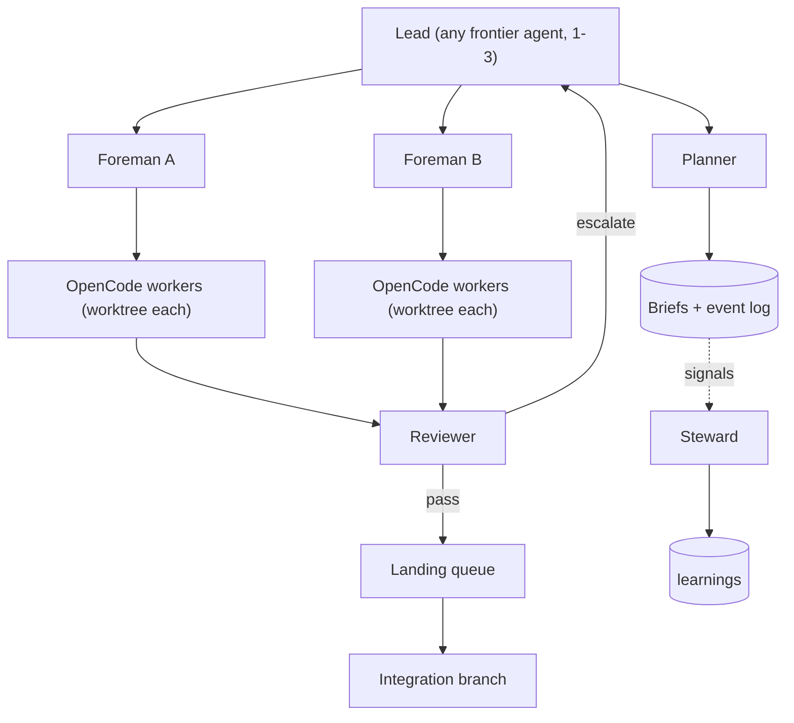

# Flywheel at scale: native feedback, personas, many workers, offline

Status: proposal · 2026-09-12

Flywheel is a small, deterministic engine that plugs in under any frontier lead. The lead (Claude
Code, Codex, OpenCode, a human, or any agent that can run a shell) plans and judges; flywheel
drives the worker agents and keeps the record. **Phase 1 workers are OpenCode only**; other
worker CLIs come in later phases behind the same adapter seam.

## 1. Goals

- **G1: feedback is part of using flywheel.** Every run or task that was not effective leaves a
  machine-captured signal. The lead (or a steward) turns signals into learnings before the
  session ends. Learnings can go upstream, with consent.
- **G2: personas as skills.** Multi-agent work needs more roles than orchestrator and worker.
  Each role is a skill that any agent can load.
- **G3: scale.** Thousands of cheap OpenCode workers run under a few frontier leads, without the
  leads' attention becoming the bottleneck.
- **G4: any lead.** Any agent that reads skills (or `AGENTS.md`) can be the lead or another
  non-worker persona. Worker adapters beyond OpenCode are later phases.
- **G5: offline.** Everything flywheel itself does works without a network; workers can run on a
  local model (§8).

Non-goals for now: a hosted service; replacing CI; landing work without review; non-OpenCode
workers in phase 1.

## 2. Friction observed so far

| Friction | Evidence | Addressed by |
| --- | --- | --- |
| Every dispatch is hand-built, and silent hangs look like slowness | stdin hang, forgotten flags, scraping session ids; ~40 hand-written dispatches per feature | `flywheel run` (#20) |
| Watchers die at host time limits | five watcher deaths at ~1 h while workers were healthy | `flywheel watch` (#22), restartable from the event log |
| Provider and account failures cost the most time | ~3 h on a key limit, then a 402, then a consent gate | `doctor` (#23), circuit breaker, approved fallbacks (§4.4) |
| A global plugin swapped the worker's agent | 21 reads of one file, zero edits | workers always run `--pure` |
| A shared working tree couples tasks | gates fail on neighbours' edits; finished work waits on the slowest worker | a worktree per task, isolated review (#24), a landing queue (§4.3) |
| The lead reads every diff | review caught every security defect, but it does not scale | reviewer persona, automated gates, escalation rules (§4.5) |
| Exploring cannot be told from lost | 53 steps of reads before any edit; 45 steps chasing a non-existent API | plan check-in, `exploring` state, drift signal |
| State in a binary DB or a mutable snapshot | no diff, no merge, no history | the event log (#11) |
| The model setting resets on upgrade | `MODEL=` lives in the skill | `.flywheel/config.json` (#12) |
| Cross-OS surprises | exec bit, CRLF, process names, a hanging `gh` upload | CI matrix, Windows guidance, per-asset uploads |
| Feedback depends on someone writing a file by hand | one consumer kept a learnings log; others would not | native signals and learnings (§6) |

## 3. Personas

A persona is a role, not a model. One agent can hold several; at small scale the lead is also
planner, foreman, reviewer and steward. In phase 1 every persona except the worker can be any
agent; the worker is OpenCode.

| Persona | Does | Does not | Typical model | Skill |
| --- | --- | --- | --- | --- |
| Lead | owns the goal, plans waves, sets policy (limits, budgets, escalation), reviews escalations | implement | frontier | `flywheel` |
| Planner | turns a spec into briefs with `owns:`/`needs:`/`exclusive:`, choke points, gates | dispatch | frontier or mid | `flywheel-planner` |
| Foreman | runs a shard of workers: `run`, `watch`, classify, retry by policy, first-pass mechanical review, escalate | plan, implement | mid, or the CLI alone | `flywheel-foreman` |
| Worker | executes one brief and reports evidence | plan, commit | cheap (OpenCode) | `flywheel-worker` |
| Reviewer | judges a finished task: `owns:` check, gates in isolation, traps, domain checklists; verdict pass / correct / reject / escalate | implement the fix | mid | `flywheel-reviewer` |
| Steward | triages signals into learnings, deduplicates, proposes upstream feedback, keeps `learnings.md` healthy | change code | cheap or mid | `flywheel-steward` |
| Operator | installs, configures, assigns personas to agents, decides who merges and publishes | — | human or any | `flywheel-operator` |

Personas talk only through repository state (the event log, briefs, learnings) and `flywheel`
commands. No agent-to-agent chat is required, so any mix of lead vendors works.

## 4. Architecture for scale



### 4.1 Deterministic core, judgment at the edges
The CLI does everything mechanical: dispatch, watch, classify, retry by policy, isolate, gate,
land, record. Agents do planning, review and the content of corrections. A foreman can be the CLI
alone (`flywheel watch` plus policy) for shards whose tasks need no judgment until review.

### 4.2 State
- The event log (#11) is the source of truth; its ordering key already makes merged logs derive
  the same state.
- **Sharding**: at scale, one file per task (`.flywheel/events/<task>.jsonl`) instead of one hot
  file. Readers merge all shards; git conflicts become rare because shards are different files.
- **Leases**: a foreman records `claimed {holder, until}` before dispatching; only the holder
  dispatches; expired leases can be reclaimed. Across machines the earliest claim wins and the
  loser cancels.
- **Optional coordinator (later)**: `flywheel serve` speaks the same event schema for sub-second
  claims when git round trips are too slow. The repository stays the durable record.

### 4.3 Isolation and landing
- Every task runs in its own git worktree on branch `fw/<task>`; workers never share a tree.
- Review runs the brief's gates in that worktree, so a task's result does not depend on other
  in-flight work.
- `flywheel land` is a local landing queue: rebase the task branch onto the integration branch,
  run the gates, fast-forward. A conflict becomes a correction brief, not a human chore. It needs
  no network; pushing and PRs are a separate, optional step.

### 4.4 Throughput controls
- Per-model limits in config: `max_parallel`, requests per minute, and a per-host cap.
- **Circuit breaker**: provider errors (key limit, 402, consent) open the breaker for that model
  and pause its dispatches; a `doctor` probe closes it. Fallbacks marked `approved` may take over
  automatically; consent gates always go to the user.
- **Budgets**: token and cost caps per wave stop new dispatches when reached.
- `exclusive:` resources (build caches, devices) are honoured by `next` and the foremen.

### 4.5 Review at scale
- Automated: the gates in the task's worktree, the `owns:` check, brief lint, and domain
  checklists (#32).
- The reviewer persona reviews every task. Escalations go to the lead: security-sensitive domains
  (auth, row-level security, tokens, crypto, payments), `owns:` violations, a second correction,
  or any reject.
- The lead also samples a share of passes; the sample shrinks as first-pass rates rise.

### 4.6 Proving scale without spending tokens
A `sim` worker adapter replays recorded OpenCode runs with a configurable mix of latency, output
caps, stalls and provider errors. CI runs a wave of 1,000+ simulated tasks through `next`, `run`,
`watch`, `review` and `land`, and asserts no double dispatch, no lost events and bounded lead
escalations. It is the only non-OpenCode adapter in phase 1, and it never calls a model.

## 5. Leads and workers

### 5.1 Skills, for any lead
- Skills are plain `SKILL.md` folders, installable with
  `npx skills add suzworx/flywheel --skill <name>` into agents that read skills (`.agents/`,
  `.claude/`, `.cursor/`, `.opencode/`, and so on), or copied by hand when offline.
- For agents that read `AGENTS.md` instead (Codex and others), `flywheel init --agents-md` adds a
  short block that points at the installed skills and the persona each agent plays.
- Skill text is vendor-neutral for leads: everything goes through `flywheel` commands and a shell.

### 5.2 Workers: OpenCode in phase 1
- `flywheel run` builds the canonical OpenCode command: `--pure`, `--auto`, `--format json`,
  `--title`, closed stdin, one run file per attempt, the model from config.
- The code keeps an adapter seam (build the fresh and resume commands; parse the output stream
  into flywheel events; classify failures) with two implementations in phase 1: `opencode` and
  `sim`.
- **Later phases** add worker adapters for other headless CLIs. Checked on 2026-09-12 for when
  that time comes: Claude Code 2.1.243 (`claude -p --output-format stream-json --verbose --bare`,
  resume with `--resume <id>`) and Codex 0.149.1 (`codex exec --json -C <dir>`, resume with
  `codex exec resume <id> -`).

### 5.3 Config
`.flywheel/config.json` (#12) grows to:
```json
{
  "workers": [
    { "name": "cheap", "adapter": "opencode", "model": "openrouter/deepseek/deepseek-v4-flash-0731",
      "max_parallel": 20, "fallbacks": [ { "model": "opencode-go/deepseek-v4-flash", "approved": true } ] },
    { "name": "local", "adapter": "opencode", "model": "ollama/qwen3:8b", "max_parallel": 1 }
  ],
  "limits": { "per_host": 32, "budget": { "wave_cost_usd": 25 } },
  "feedback": { "upstream": "suzworx/flywheel", "submit": "ask" }
}
```

## 6. Native feedback

### 6.1 Signals (automatic)
The CLI appends a `signal` event whenever a run or task is not effective:

- a failed start check, a stall, an output cap, a read loop, drift (many steps, no edits);
- a provider error, or the breaker opening;
- a second correction on one task, a reject verdict, an `owns:` violation, a gate failing outside
  `owns:`;
- a watcher restart, a landing conflict, a budget stop.

Each signal carries its kind, task and evidence (run file, session, counts). No agent has to
remember to write it.

### 6.2 Learnings (curated)
- `flywheel feedback` lists untriaged signals.
- `flywheel feedback add` records a learning with severity (P0/P1/P2), title, observed, evidence,
  ask, and the signals it explains.
- `flywheel feedback dismiss <signal> --reason` closes a signal that needs no learning.
- `learnings.md` is derived from the log, as entries in the Observed / Evidence / Ask format
  consumers already write by hand.

### 6.3 Hard rules
- The skills say: when flywheel is not effective, record it before moving on, and a session does
  not end with untriaged signals.
- The CLI enforces it: `checkpoint`, `land` and `handoff` refuse while signals are untriaged,
  unless the caller passes `--allow-untriaged` with a reason, which is itself recorded.

### 6.4 Upstream, with consent
- `flywheel feedback export` writes a sanitized report: repo-relative paths only, no code, no
  secrets, no project names unless allowed.
- `flywheel feedback submit` opens an issue on the upstream repo through `gh`, only after the user
  approves the exact text. Never automatic, and it is the only feedback step that needs a network;
  offline, the export waits in `.flywheel/feedback/outbox/`.

### 6.5 Measuring flywheel itself
`flywheel stats`: first-pass review rate, corrections per task, signals per 100 runs, time lost
by signal kind, cost per landed task. The trend is the health metric for flywheel.

## 7. Phases

| Phase | Scope |
| --- | --- |
| 0 (in flight, #10) | event log (#11), config (#12), skill feedback (#13-#18) |
| 1 | OpenCode `run`/`status`/`watch` (#20-#22) behind the adapter seam, plus `sim`; signals and `flywheel feedback`; persona skills; `AGENTS.md` bootstrap for leads; offline mode (§8) |
| 2 | worktree per task, isolated review (#24), local landing queue (reshapes #25), limits, breaker, budgets, `doctor` (#23), `next` (#27), leases, sharded log, the 1,000-task simulated wave in CI |
| 3 | more worker adapters (Claude Code, Codex, generic), multi-machine through git-merged shards, the optional coordinator, `stats` |

## 8. Offline

What needs a network today, and how each part works without one:

| Part | Online today | Offline |
| --- | --- | --- |
| flywheel CLI | none: Go stdlib, local files, git | works as is; builds offline (no module dependencies) |
| State, review, landing | none (local git) | works as is; push and PRs wait until online |
| Worker model | OpenRouter / OpenCode Go | an OpenCode provider pointing at a local OpenAI-compatible server (Ollama, LM Studio) |
| OpenCode itself | install; provider packages may download on first use; `@latest` plugins fetch at start | install and run each provider once while online; workers run `--pure`, so plugins never fetch |
| Lead | frontier API (Claude, Codex) | needs its API; fully offline means a local lead too, which is much weaker, or a human lead |
| Skills | `npx skills add` downloads | copy the skill folders |
| CI, releases, upstream feedback | GitHub | run the gates locally; publish and submit feedback later from the outbox |

Making it first-class:
- `flywheel init --local <model> [--local-url URL]` writes the OpenCode provider block for Ollama
  (`baseURL http://localhost:11434/v1`) and a `local` worker entry in config — implemented (#44).
- `flywheel doctor` probes the local endpoint like any other model, and reports when a provider
  package or plugin would need the network.
- `max_parallel` for local workers comes from the hardware, not from the provider: one CPU-only
  host runs one or two small-model workers, so thousands of workers is an online-provider story.
- A local model is weaker than the online worker model; the brief rules (write rule, plan check-in,
  small scope) matter more, and signals will show where it is not good enough.

## 9. Open questions

- How many workers one foreman can run before its context or the host becomes the limit.
- Disk and git cost of thousands of worktrees; sparse checkout or shared object stores may be
  needed.
- Whether the coordinator is needed at all if shards and leases hold up in the simulated test.
- Which local coding models are good enough as offline workers on CPU-only hosts.
