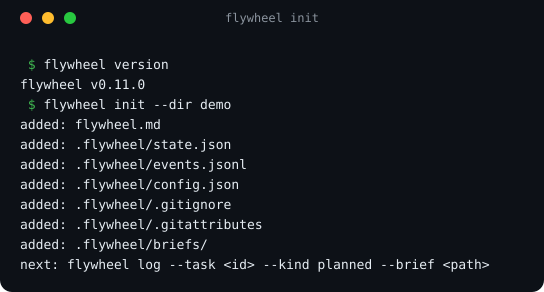
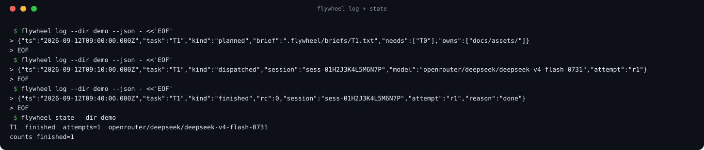
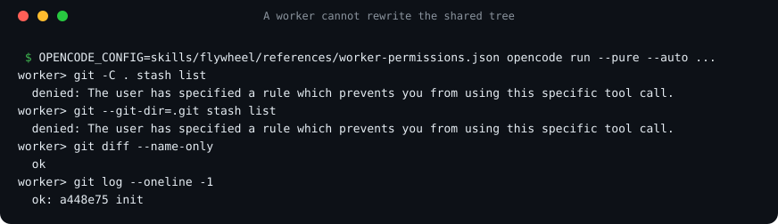
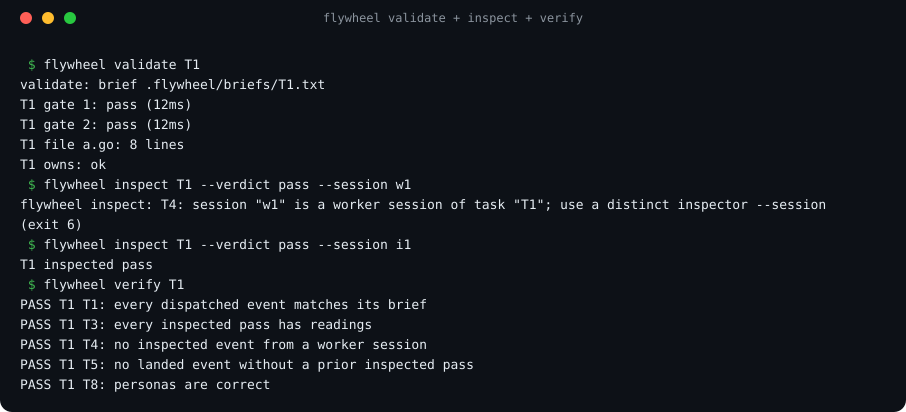
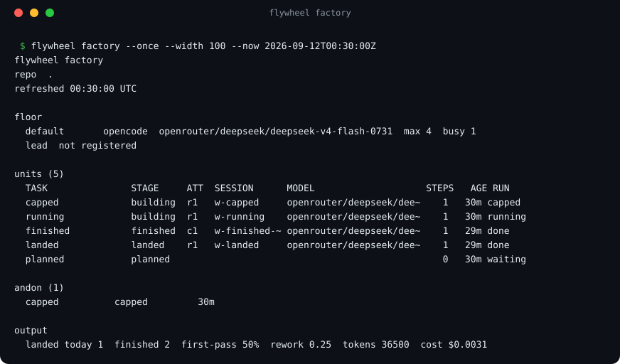

# flywheel features

This page walks through what flywheel does beyond the core loop (plan, brief, dispatch, review,
correct-or-land): how a dispatch is watched, how the gauges measure a unit, the worker adapters
and how a model is picked, the limits that keep a wave safe, recovery after a crash, per-task
worktrees, the review agent and its panel, and shipping. The [README](https://github.com/suzworx/flywheel#readme) has the short
version and the CLI table; [PROTOCOL.md](PROTOCOL.md) is the normative contract every command
implements; `flywheel help <command>` prints any command's flags.

## Contents

- [See it](#see-it)
- [Dispatch, watch and wait](#dispatch-watch-and-wait)
- [Sharded log](#sharded-log)
- [Measure, don't trust](#measure-dont-trust)
- [Worker adapters](#worker-adapters)
- [Routing, budgets and rate limits](#routing-budgets-and-rate-limits)
- [Controller and health](#controller-and-health)
- [Recover and checkpoints](#recover-and-checkpoints)
- [Freeze and resume](#freeze-and-resume)
- [Wake by schedule](#wake-by-schedule)
- [The factory view](#the-factory-view)
- [Metrics](#metrics)
- [Fleet](#fleet)
- [Offline](#offline)
- [Worktrees and needs-state](#worktrees-and-needs-state)
- [Product lines and staffing](#product-lines-and-staffing)
- [Review agent and panel](#review-agent-and-panel)
- [Ship](#ship)

## See it

Real transcripts, rendered from actual CLI output.

*`flywheel init` scaffolds `flywheel.md` plus the `.flywheel/` state files.*

*A task's life is recorded in the append-only event log; state is derived from the log, not stored
alongside it.*

*Real output: the worker's tree-rewriting git commands are refused even under `--auto`; read-only
git still works.*

*The gauges measure the tree; inspect refuses to pass a unit that has no supervisor readings on record.*

*Real output: the factory floor at a fixed instant, showing landed, running, finished-awaiting-inspection, capped and planned units.*

## Dispatch, watch and wait

- **Set up** — `flywheel init` scaffolds `flywheel.md` plus the `.flywheel/` state files. It ends
  with a factory summary — the worker lines, limits, audit policy, which enforcement layers are
  installed (and the command for each missing one) and how to view the floor. Building the full
  factory — lines, staffing, and the policy that keeps it safe — is
  [epic #69](https://github.com/suzworx/flywheel/issues/69).
- **Run** — the lead records each work order as an event with `flywheel log --kind planned`;
  `flywheel run` dispatches it to a worker through the `claude`, `codex`, `opencode` or `sim`
  adapter and records the run automatically. For parallel units `flywheel run --worktree` is the
  default: each unit builds in its own `.flywheel/worktrees/<task>` on branch `fw/<task>`, against
  the main ledger. `--worktree --base REF` branches a new `fw/<task>` from REF, without checking
  REF out. Without `--base` a new `fw/<task>` starts from `origin/<integration.branch>` (else the
  local branch) when `integration.branch` is set, and is refused when neither resolves; otherwise
  from the main checkout's HEAD, with a warning when HEAD carries commits `origin/main` lacks
  (#550). The `dispatched` event's `base` records the commit the unit branched from.
  `flywheel run --session ID` (default `$FLYWHEEL_SESSION`) records the dispatching lead session as
  the dispatched event's `lead`, so leads sharing one ledger can tell their units apart.
- **Take a plan back** — `flywheel log --task <id> --kind withdrawn --note "<why>"` withdraws a
  planned unit; it is refused while the unit's attempt is dispatched or running (rule W1, exit 6).
- **Watch** — `flywheel state` derives the floor from the event log; `flywheel factory` opens an
  interactive, k9s-style view of the floor (see [The factory view](#the-factory-view); `--plain`
  keeps the plain redraw), and `flywheel watch` streams every event as one readable line.
  When any unit runs in a worktree, the plain floor's (`flywheel factory --plain`) units table adds
  a TREE column with that worktree and its base commit (`CP-A@abcdef1`), and the `--json` view
  carries `workdir` and `base`.
- **Know when a unit finishes** — never background a dispatch with a bare `&` and hope to notice:
  `flywheel wait <task>... [--timeout D]` blocks until each named task finishes its current (or
  first) attempt, printing `<task> <attempt> finished reason=<r>` as each lands (exit 0 all clean,
  4 any unclean, 8 timeout), and `flywheel run <task> --notify CMD` runs `CMD` through the shell
  when the run returns on any path, with `FLYWHEEL_FINISHED="<task> <attempt> reason=<r> exit=<code>"`
  in its environment; a failing notify only warns.

## Sharded log

By default the event log is a single `.flywheel/events.jsonl` file. For large factories with many
parallel tasks, `flywheel log --shard` switches to per-task shards under `.flywheel/events/`: one
file per task plus `@floor.jsonl` for global events (goals, feedback, etc.) and
`@session-<id>.jsonl` for session boundary events. The sharded layout is one-way — the legacy file
is sealed and kept — and opt-in via config so older binaries are fenced out. Readers merge the
legacy file first, then stable by each shard's running-max timestamp, preserving the linearized
order. Each shard has its own hash chain with a genesis block and a `sharded` seal (with the kind's
fields), and `flywheel verify --log` checks them all. Transient shard locks under
`.flywheel/locks/` guard concurrent writes per shard and are git-ignored.

## Measure, don't trust

`flywheel validate` runs a task's gates and checks its `owns` boundary, recording supervisor
readings; `flywheel inspect` only passes a unit whose readings are on record (and refuses a worker
session's verdict); `flywheel verify` checks every poka-yoke rule. `validate` exits 5 when a gate
fails or a change sits outside `owns`, and an `inspect` refusal exits 6.

## Worker adapters

`flywheel run` dispatches through one of four adapters: `claude`, `codex`, `opencode`, or the
offline `sim` adapter used by tests and this repo's own demo. Each worker in
`.flywheel/config.json` names its adapter; `flywheel run --worker <name>` picks between several
configured workers, so one factory can mix them. The `claude` adapter (issue
[#49](https://github.com/suzworx/flywheel/issues/49)) builds this repository: its units are
dispatched to `claude-haiku-4-5` workers through it. The `codex` adapter (issue
[#275](https://github.com/suzworx/flywheel/issues/275)) runs `codex exec --json --sandbox
workspace-write`, points the worker at the brief file (the prompt stays one line, so the Windows
npm shim cannot truncate it), and parses Codex's JSONL events; Codex reports tokens but no cost,
so `limits.budget` does not count its spend. Resume uses `codex exec resume <thread id>`.

On the `claude` adapter, a worker's only way to run its own gate lines is its Bash tool, and
`--permission-mode acceptEdits` alone grants file edits — not commands. Each worker in
`.flywheel/config.json` can therefore set `allowed_tools` and `disallowed_tools` (Claude Code
tool patterns) to shape the dispatch's `--allowedTools`/`--disallowedTools`. Unset, a worker
defaults to `allowed_tools: ["Bash"]` and a `disallowed_tools` covering the git-write family
(`Bash(git commit:*)`, `Bash(git push:*)`, `Bash(git stash:*)`, `Bash(git reset:*)`,
`Bash(git checkout:*)`, `Bash(git rebase:*)`, `Bash(git merge:*)`): the worker can run its own
gates but still cannot commit, stash, reset, checkout, rebase or merge — the worker permission
policy is enforced by the permission layer, not by asking nicely. The default also denies
`git fetch` and `git pull`, because they write refs and reach the network. An explicitly configured list
replaces its default; it is not merged with it, so an operator can widen or narrow deliberately.
A misspelt key is named with its nearest known key (`unknown key "allowedTools"; did you mean
"allowed_tools"?`, issue #463).
A claude worker's `permission_mode` sets its `--permission-mode`: `acceptEdits` (the default),
`bypassPermissions`, `default`, `plan` or `dontAsk`
(`flywheel config set workers.<name>.permission_mode bypassPermissions`); `disallowed_tools` is still enforced under
every mode, `bypassPermissions` included. A tool the worker is denied raises the
`permission-denied` andon live, while the run is still going (`andon: <task> <attempt>
permission-denied <tool> (live)`), and `flywheel lint` warns when a brief asks for web research
but the default claude worker has no WebSearch/WebFetch in `allowed_tools` (issue #526).
A claude worker's `--max-turns` is its `max_turns`, else `limits.max_turns`, else 200
(`flywheel config set workers.<name>.max_turns N`; issue #459).
`limits.unit_cost_usd` caps what one unit spends: its worker attempts, corrections included, and
its agent review rounds (the sum of `cost` over its `finished` events and its `reviewed` events
that carry a cost); a worker's `unit_cost_usd` overrides it, and 0 means no
cap (`flywheel config set limits.unit_cost_usd 5`). A unit already at its cap is refused at
dispatch (exit 6, rule `unit-cost`; raise the cap or split the unit). A running attempt that
reaches it is stopped: a claude worker gets `--max-budget-usd` set to what the unit has left, and
a worker that streams a cost per step (opencode) is stopped at the step that reaches the cap.
Either way the attempt finishes with reason `capped`, the note
`unit cost cap $<cap> reached: $<spent> spent on the unit`, a checkpoint and a `capped` signal
(issue #459).
A claude worker loads no MCP servers (`--strict-mcp-config`) unless its `mcp` key lists them in
the `--mcp-config` shape, e.g. `"mcp": {"mcpServers": {"fs": {"command": "mcp-fs"}}}` (issue #425).

`flywheel run` exits 0 on a clean finish, exit 3 on a silent start (no output before the start
timeout), 4 when the worker exited nonzero, capped, or hit a provider error, and exit 7 on a
mid-stream stall (no run-file line for the stall timeout while the process is still alive).

## Routing, budgets and rate limits

`limits.breaker` stops dispatching to a model after consecutive provider errors, until a cooldown
passes; unless `--model` was given, an approved fallback takes over (`fallbacks[{model, approved: true}]`,
the first whose own breaker is closed).
`flywheel doctor` launches each probe as `flywheel run` launches a worker (the prompt on stdin for claude, the worker's permission mode and tools) and prints why a probe is not ok, e.g. `m: error (exit 1: <first stderr line>)` ([#637](https://github.com/suzworx/flywheel/issues/637)).
`flywheel doctor --record` records each probe, the why in its note; an `ok` probe closes that model's breaker at once instead of waiting out the cooldown.

A worker's optional `routing` block (`candidates`, `objective` one of `cost_per_accepted`, `accepted_rate`, `gate_pass_rate` or `clean_rate`, `explore`, `min_attempts`, `seed`) makes `flywheel run` pick each fresh dispatch's model from the `flywheel stats --by model` scoreboard, exploring another candidate by a deterministic draw (same ledger, seed and task, same choice) and recording the choice as `route` on `dispatched`. A brief's optional `kind:` header (`feature`, `fix`, `refactor`, `test`, `docs`, `chore` or `perf` by default; `lint.kinds` in config replaces the list, and `flywheel lint` checks it) routes on that kind's own scoreboard once any candidate has enough attempts there, and on the model-wide one otherwise, `route.basis` saying which ([#475](https://github.com/suzworx/flywheel/issues/475)).
It is off by default; `--model` overrides it, a `--resume` keeps its model, and the breaker still applies to the routed model.

`limits.budget.wave_tokens` caps the wave's recorded tokens (input, output and reasoning — a cost budget cannot cap an adapter that reports no cost), and `limits.rate_per_minute` caps dispatches of one model in any 60 seconds; both are refused by `flywheel run` (exit 6, rules `budget` and `rate`); `flywheel next` HOLDs on a spent token budget and dispatches no more than the model's free rate slots.

A worker cut off by a provider rate limit finishes `rate-limited` (exit 4, no signal, not a breaker error), and `flywheel run` waits for the reset and resumes the same session:
`limits.rate_limit_retries` is how many times it resumes (default 3; 0 disables).
When `flywheel run` has exited, the controller resumes the unit itself once the reset passes (`controller.auto_resume`, default on; `controller.notify` is a shell command run per resumed unit), within the same retry cap; `flywheel supervise --resume-limited` is the one-shot form.
`limits.rate_limit_max_wait` is the longest it waits for a reset, a Go duration (default `5h`).
`limits.rate_limit_pause_at` pauses a claude model before the limit hits, once its stream reports that share of the window used (default `0.95`; negative disables), until the exact reset the stream gave.
Until the reset the whole model is paused: `flywheel run` refuses new units on it (exit 6, rule `rate-limit`), `flywheel next` HOLDs, and the floor shows `rate-limited until HH:MM` with a `model/<model>` andon entry.

An abandoned attempt — lease expired, or no lease and its run file idle longer than `limits.lost_after` (a Go duration, default `24h`) — is marked `lost` by `flywheel run`, `flywheel next` and the controller, so it never blocks a dispatch as an owns or exclusive collision.
`flywheel run` also refuses a second dispatch of a task whose attempt is still dispatched or running, in every mode (exit 6, rule `in-flight`, [#522](https://github.com/suzworx/flywheel/issues/522)): wait for it to finish, or for a dead worker to be marked lost after `limits.lost_after`.
A gate that needs the host to itself (device or timing measurements) is written `gate[quiet]: <command>`: validate waits up to `limits.quiet_wait` (default `30m`) for no other worker or gate on the host, holds new dispatches while it runs, and records the reading inconclusive (`host busy: ...`), never failed, when the host stays busy.

## Controller and health

The controller records the factory's health in the ledger: `flywheel controller --health-every D` (default `5m`, `0` disables) appends a `health` event at most once per interval (running, stalled, rate-limited, finished and andon counts, the paused models with their resets, the oldest in-flight unit, the controller generation and the flywheel version).
`flywheel status --health` prints the latest one as a line (`--json` for the snapshot with its ts and age), or `health: none recorded`; one older than `--stale-after D` (default `10m`) prints `health STALE (<age>): the controller is not recording; run flywheel controller` and exits 1, so a supervisor notices a dead controller.

## Recover and checkpoints

`flywheel recover` gives the answer to trust after a crash, a credit outage or a new lead session, and every session starts with it. It is read-only. It checks the log's hash chain and every verify rule, then compares each unit's world with the ledger: worktree HEAD against the attempt's commit, uncommitted paths against what the attempt wrote, lease, torn run file, stacked base and paused model. For each unit it prints one next action (`mark-lost`, `wait-reset`, `resume-session`, `rebase`, `assign-owner`, `re-validate`, `review`, `inspect`, `land`, `investigate` or `none`; `assign-owner` names the open blocking findings outside the unit's owns) with its reason and the exact command; `--json` prints the same report as JSON. `--apply` runs only the safe actions (mark-lost, re-validate, a conflict-free rebase), records a `recovered` event, and lists the rest for the lead.

Work is never lost when an attempt is interrupted: an attempt that ends uncleanly after writing owned files, or one marked lost, is snapshotted to `refs/flywheel/checkpoints/<task>/<attempt>` without touching the branch or the index, and `flywheel checkpoint list|diff|restore|drop` brings it back ([#422](https://github.com/suzworx/flywheel/issues/422)). `limits.checkpoint_every` (a Go duration, default `10m`; `"0"` off) also checkpoints an attempt running in its task worktree on that interval, only when its owned files changed.

## Freeze and resume

**Suspend.** `flywheel suspend --session S [--reason TEXT] [--until TIME]` freezes the whole factory ([#578](https://github.com/suzworx/flywheel/pull/578)). It records a `suspended` event carrying the session, the reason and, with `--until`, the thaw time (RFC 3339, or `HH:MM` local: today, or tomorrow once that time has passed). Past `--until` the factory thaws by itself, with no event. A second `flywheel suspend` while suspended is refused (exit 6, rule `suspended`).

**The refusal rule.** While suspended every dispatch path refuses and appends nothing: `flywheel run` exits 6 with rule `suspended` (`the factory is suspended since <ts> by <session>: <reason>; flywheel resume --session <s> to thaw`), `flywheel next` turns each `DISPATCH` into a `WAIT` naming the suspension, and the controller's and `flywheel supervise --resume-limited`'s auto-resume start nothing, reporting each unit not resumed with reason `suspended`. `flywheel status` prints a `SUSPENDED since …` line first (`suspended` in `--json`), and the floor lists a `factory suspended` andon entry first.

**Stop the live workers.** `flywheel suspend --stop` also stops every worker that is running ([#584](https://github.com/suzworx/flywheel/pull/584)). It writes the sentinel `.flywheel/suspend.stop`; each running `flywheel run` checks it on every lease tick (`lease.renew_interval`), kills its worker the way the stall watchdog does, and finishes the attempt with reason `suspended` and note `stopped by suspend at <ts>`. The finished event keeps the session, the owned files the worker wrote are checkpointed, a worktree's changes stay in the worktree, and that `flywheel run` exits 6. The floor shows the unit `suspended`, not failed.

**Resume exactly.** `flywheel resume --session S [--note TEXT]` thaws the factory (exit 6 when it is not suspended), removes the sentinel and continues every unit a `--stop` stopped, each in its own session: it writes the continue delta `.flywheel/briefs/<task>.delta.txt` (the brief's owns, needs and gates, then the note that the worker was stopped by a factory suspension) and starts `flywheel run <task> --resume` in the background, printing `resumed <task> <attempt> (log .flywheel/runs/<task>.autoresume.log)` for each. `--no-redispatch` only thaws.

**In recover.** `flywheel recover` offers a stopped unit `resume-session` with the reason `stopped by a factory suspension`: the command is `flywheel resume --session <s>` while the factory is still suspended, and `flywheel run <task> --resume` once it has thawed.

**Automatic freeze.** The factory freezes itself when every model's tokens run out, with reason `tokens-exhausted` and the stop of the live workers, and thaws when they return, resuming each stopped unit in its own session ([#600](https://github.com/suzworx/flywheel/pull/600)). The factory view's header then reads `factory FROZEN since … until …` and each stopped unit's why says when it resumes.

## Wake by schedule

The controller only acts while something runs it. `flywheel schedule install [--every D]` registers an OS scheduled task that runs `flywheel controller --once --dir <repo>` every `--every` (default `15m`, at least `1m`, whole minutes), so the factory wakes with no flywheel process running ([#582](https://github.com/suzworx/flywheel/pull/582)). Each run of `controller --once` marks lost attempts, blocks scrapped needs, records health and, with `controller.auto_resume` on (the default), resumes the rate-limited units whose reset has passed; a suspended factory resumes nothing.

- **Windows** — a Task Scheduler task (`schtasks /Create /SC MINUTE /MO <n>`).
- **Linux** — an entry in the user crontab, marked by a `# flywheel-schedule <name>` line above it; its output goes to `.flywheel/schedule.log`. Cron can run under an hour, or whole hours under a day.
- **macOS** — a launchd LaunchAgent in `~/Library/LaunchAgents`, labelled `io.github.suzworx.<name>`.

There is one task per repository, named `flywheel-<directory name>-<first 8 hex of the sha256 of its absolute path>`, so two checkouts with the same name never share one. `flywheel schedule status` says whether it is installed (with the scheduler's detail), `flywheel schedule remove` deletes it, and a re-install replaces it. The task runs the binary that installed it, by its absolute path.

## The factory view

`flywheel factory` on a terminal opens a k9s-style view of one ledger ([#583](https://github.com/suzworx/flywheel/issues/583)); [factory-view.md](factory-view.md) has every key, and the [Screens](screens.html) page draws each screen with what is shipped.

- **Layout** — a header with the factory's context (repo, `factory running` or `factory FROZEN since … until …`, paused models, lead, health, version), the last 24 hours' numbers and the key menu of the screen shown; a title bar with the view, its filter, row count and sort; the flash line; and the crumbs. Ctrl-E hides the header, Ctrl-G the crumbs, Ctrl-W shows every cell whole and Ctrl-R reloads.
- **Views** — `:` opens a view by name or alias: `units`, `workers`, `andon`, `events`, `lines`, `tree` (the needs tree, like k9s xray), `health`, `learnings`, `checkpoints`, `pulse` and `metrics`. Esc goes back, `-` swaps to the last view, `[` `]` walk the `:` history, Ctrl-A lists them all. `/` filters (`/re`, `/!re` inverse, `/-f` fuzzy); Shift-N, A, S, C sort.
- **Unit why and timeline** — Enter on a unit opens its detail at the why: one plain sentence from the ledger's facts, the same one `recover` would give (also the units table's last column, WHY), then its timeline with every gap over five minutes labelled (`waiting for the rate-limit reset`, `frozen by suspend`, `waiting for inspection`) and a `total · touch · flow efficiency` line. `w` `d` `y` `l` `c` `F` `e` switch to why, explain, brief, log, checkpoints, findings and events; `J` opens the first unmet need. The log follows a running unit; `w` wraps, `t` hides the timestamps, `f` goes fullscreen.
- **`:pulse` and `:metrics`** — six panels (flow, quality, reliability, cost, capacity, by model) and a table of every metric with its trend and change over a window (`1` 24h, `2` 7d, `3` 30d). Enter opens a metric's drill-down: its chart (a histogram, a control chart, the WIP flow, or bars) with `h`, the exact units behind the number with `u`, and Enter on one of them opens its why.
- **Search** — `:s <text>` searches the ledger, the run logs, the reports and the briefs; Enter opens the match.
- **Headless frames** — `flywheel factory --keys SEQ --frames` (with `--width`, `--height` and `--now`) renders the same view without a terminal and prints each frame as JSON, one per key token (`j`, `<enter>`, `<ctrl-a>`, `"andon"`); the [live demo](demo.html) is made from these frames by `scripts/demo-web.sh`.
- **Colours and skins** — each row takes the colour of its state (cyan running, green passed, yellow waiting, red failed or stalled, magenta frozen, dim landed), a row that changed is drawn bold for two refreshes, and a key never waits for the ledger, which is read in the background. `factory.skin` in `.flywheel/config.json` is `dark` (the default), `light` or `none`.
- **Actions** — in the units view and a unit's detail, `v` validates, `i` inspects (as `FLYWHEEL_SESSION`), `r` resumes and `x` withdraws the marked units (`space` marks) or the one under the cursor; `Z` and `R` suspend and resume the factory. Each asks `y/N` with its command shown, runs the flywheel binary itself in the background so the CLI's rules decide, flashes its exit and keeps its output for `:result`. `--readonly` turns the actions off; `.flywheel/hotkeys.json` binds free keys to views.

## Metrics

`flywheel stats --metrics [--window 24h|7d|30d] [--json]` computes the factory's lean metrics from the event log alone: flow (throughput, WIP, lead, queue, cycle and touch time, flow efficiency), quality (first-pass yield, rework, gate fail rate, review findings), reliability (andons, MTTR, frozen and paused time), cost (spend, cost per landed unit, tokens per step, by model) and capacity (utilization, idle). Each value has a trend against the previous window of equal length, and each is backed by the units behind it. [metrics.md](metrics.md) defines every number; the factory view's `:pulse` and `:metrics` draw the same report.

## Fleet

A lead often runs several ledgers at once: the main checkout, sibling checkouts, unit worktrees and other repositories. `flywheel fleet add <path> [--name N]` registers a root in one per-user `fleet.json` (`FLYWHEEL_FLEET` points elsewhere), `flywheel fleet remove <name>` drops it, `flywheel fleet list` shows each root and every ledger found under it (its git worktrees, `.flywheel/worktrees` and `.claude/worktrees`), and `flywheel fleet status [--all] [--idle-after D]` prints one merged table, one row per ledger, with its running, passed, finished and andon counts, state, health and last activity; a git worktree shows its own activity, and idle worktree ledgers fold into one row per root ([#585](https://github.com/suzworx/flywheel/issues/585)). See [fleet.md](fleet.md). In progress: a fleet learnings queue, `flywheel fleet watch`, and the fleet as a screen in the factory view (`:ctx`).

## Offline

`flywheel init --local <model> [--local-url URL]` points OpenCode workers at a local OpenAI-compatible server (Ollama at `http://localhost:11434/v1` by default; LM Studio or a llama.cpp server with `--local-url`): it adds an OpenCode provider `flywheel-local` to `.flywheel/opencode-worker.json` and a worker named `local`, so `flywheel run <task> --worker local` dispatches to the local model. Run each provider once while online (OpenCode may fetch its provider package on first use). A local model is weaker than an online one: keep briefs small and let the signals show where it is not good enough. `flywheel doctor --worker local` asks the server first: `local endpoint down` when it does not answer, `model not pulled` when it does not serve the model. It contacts a loopback server only (`localhost`, `127.0.0.1`); any other host is left to the ordinary probe, so `doctor` on an unfamiliar checkout never reaches hosts its config names.

With no model at all, the `sim` adapter replays a recorded run file (the worker's `model` is the fixture's path), so every command can be driven without an API key; see the README's 60-second tour.

## Worktrees and needs-state

**Worktrees.** `flywheel run <task> --worktree` runs the worker in the task's own git worktree (`.flywheel/worktrees/<task>`, branch `fw/<task>`) while the factory keeps one ledger; the attempt records it, so `flywheel validate` and `flywheel inspect` measure that tree by default. `flywheel land <task> --merge` then lands it through a local queue, one unit at a time: rebase onto the integration branch, re-run the gates, fast-forward, remove the worktree; on a conflict it merges the integration branch into the unit instead, leaving the conflict markers in the worktree, and writes a correction brief to dispatch there ([#45](https://github.com/suzworx/flywheel/issues/45)).

**Stacked units.** A unit branched from another unit's `fw/<T>` whose base then landed as a squash shows `stacked` on the andon, and `flywheel land` refuses it (rule `stacked`); `flywheel rebase <task>` moves `fw/<task>` onto the integration branch and records the new base. The integration branch is `integration.branch` (`flywheel config set integration.branch main2`), else `main`, else `master` ([#456](https://github.com/suzworx/flywheel/issues/456)). A rebase done by hand is recorded with `flywheel log --task <t> --kind rebased --base <ref> --note "<old base> onto <ref>"` ([#498](https://github.com/suzworx/flywheel/issues/498)). When a hand rebase went unrecorded, `flywheel validate` prints `base drift: recorded <old>, branch forks from <fork>; record it: ...`, and `flywheel rebase` starts from the branch's real fork point instead of the stale recorded base, so it never replays the integration branch's own commits; after a rebase it re-runs `worktree.setup` when one is configured, so dependencies installed from a moved lockfile are fresh, and a failing setup exits 1 naming the command ([#672](https://github.com/suzworx/flywheel/issues/672)).

**Worktree setup.** A fresh worktree has no dependencies (no `node_modules`, no venv), so before every `--worktree` dispatch flywheel prepares it ([#430](https://github.com/suzworx/flywheel/issues/430)): each brief `needs-state:` entry annotated `(link)` (`needs-state: node_modules/ (link), apps/web/node_modules/ (link)`) is linked from the repo into the worktree (a directory junction on Windows, a symlink elsewhere), then the `worktree.setup` command runs there with bash (`flywheel config set worktree.setup "npm ci"`; `worktree.setup_timeout`, default `10m`; `FLYWHEEL_TASK`, `FLYWHEEL_WORKTREE` and `FLYWHEEL_ROOT` are set). Setup runs on every dispatch, so it must be idempotent. A relative script path missing from the worktree but present in the root resolves against the root, though `"$FLYWHEEL_ROOT/<script>"` is clearer; on Windows gates and setup run in Git for Windows' bash, never the WSL launcher. A `worktree_setup` event records the linked paths, exit code, duration and output tail; a missing link target or a non-zero setup refuses the dispatch (rule `setup`) and no worker starts. A linked path holding links into the main checkout (a workspace's `node_modules/@acme/web -> packages/web`) is warned about and recorded as `escaped`, since the unit's gates would import the main checkout's copies, and refused with `worktree.strict_links` true ([#460](https://github.com/suzworx/flywheel/issues/460)).

**Install.** For a workspace repository annotate it `(install)` instead (`needs-state: node_modules/ (install)`): flywheel runs the package manager's offline install in the worktree once per dispatch, after the copies and before setup, picked by the lockfile at the worktree root (`pnpm install --offline --frozen-lockfile`, `bun install --frozen-lockfile`, `yarn install --immutable` or `--frozen-lockfile --offline`, `npm ci --prefer-offline --no-audit`), skipped while `.flywheel/install.sha256` matches the lockfile and the paths exist, and recorded as `installed` and `install`; no lockfile, a failed install or a path both `(link)` and `(install)` refuses the dispatch.

**Copy.** A single git-ignored file such as `.env` is copied instead: an entry annotated `(copy)` (`needs-state: .env (copy)`) and every `worktree.carry` path (`flywheel config set worktree.carry ".env,config/local.json"`) are copied from the repo into the worktree on every dispatch, before setup, and recorded as `copied` (paths only, never contents); a missing source or a path git tracks in the worktree refuses the dispatch, and a copied path git does not ignore is warned about ([#471](https://github.com/suzworx/flywheel/issues/471)). `flywheel validate --carry PATH` copies a path into `--workdir` the same way before its gates run.

**Environment preconditions.** A brief header line `needs-env: NAME[, NAME...]` names environment variables the gates or live round read (a secret, say); `flywheel run` refuses (exit 6, rule `needs-env`, only a `dispatch_refused` event recorded) and `flywheel validate` refuses (exit 6, no gate run) while one is unset or empty in flywheel's environment, naming the variables but never printing a value, and `flywheel lint` flags an invalid name or an empty line ([#534](https://github.com/suzworx/flywheel/issues/534)).

**Capacity preconditions.** A brief header line `preflight: CMD`, repeatable, names a command that must exit 0 before `flywheel run` dispatches: for a unit that spends a metered external resource, `preflight: ./scripts/check-budget.sh 5` reads the remaining balance of an external budget and exits non-zero below what the unit needs. Run runs each in order in the repository root and refuses on the first failure (exit 6, rule `preflight`, no attempt recorded) naming the command, its exit code and its first output line, so a spent budget refuses up front instead of failing the attempt midway; a correction unions the base brief's commands with its own. Preflight runs before the dispatch lock, so a slow check never stalls another dispatch, and a refused dispatch — a rule refusal or a dispatch lock that stayed busy — is recorded as a `dispatch_refused` event that `flywheel status` shows as `refused: <rule>` ([#651](https://github.com/suzworx/flywheel/issues/651)). `flywheel validate` does not run preflight, and `flywheel lint` flags an empty line ([#635](https://github.com/suzworx/flywheel/issues/635)).

**Gate probes.** `flywheel lint <brief> --probe --task <id>`, run in the base checkout before `log --kind planned`, runs each `gate:` once on the base tree (a failing gate warns, one that cannot start is a problem) and records each result as a `gate_probed` event. Pass `--task <id>` so validate can tell a broken gate from broken work: when a gate fails, `flywheel validate` adds `<task> gate <N>: note: this gate already failed on the base tree before dispatch (exit <rc>): <reason>` if its newest probe of the same command failed, and `flywheel explain` notes the same on the failed gate's line; the exit code is unchanged ([#544](https://github.com/suzworx/flywheel/issues/544)).

**Test runner check.** A brief that gates a JavaScript unit with `node --test <file>` while the repository runs vitest makes the worker write a shim to pass the gate. `flywheel lint` warns, once per gate, when a gate runs `node --test`, vitest, jest, mocha, ava or `playwright test` (bare or after `npx`, `pnpm exec`, `yarn` or `bunx`) and the repository's runners do not include it: those its package.json `test` and `test:*` scripts invoke plus the ones its dependencies and devDependencies bring, or `lint.test_runners` in config when set (runner names `node:test`, `vitest`, `jest`, `mocha`, `ava`, `playwright`). A gate calling the test script (`npm test -- <file>`) never warns; no package.json, one that does not parse, or one naming no runner means no check ([#646](https://github.com/suzworx/flywheel/issues/646)).

**Gate command check.** A correction delta written as `gate: (as the brief)` runs as shell, exits 127 and can never pass, because gates are fixed per attempt. `flywheel lint` reports a problem when a gate's first command word (after `!`, `(`, `{`, `VAR=value`, `env`, `timeout N` and a leading `cd DIR &&`) is not a command: not a builtin or keyword, not an existing path, not on PATH, and not resolved by `command -v` in the shell gates run in; a gate wrapped wholly in `(...)` or `<...>` with no `&&`, `||`, `;`, `|` or `$` is placeholder text when it says `as the brief`, `same as`, `see brief`, `as above`, `unchanged`, `inherit`, `TBD` or `TODO` (and the like) or its first word does not resolve, whatever the host has on PATH. No gate is executed. `flywheel run` checks the gates the attempt will be measured with (a delta's, else the base brief's) the same way before dispatch and refuses with rule `gate-command` (exit 6). List tools that only exist on the gate shell's PATH at gate time in `lint.gate_commands` in config ([#662](https://github.com/suzworx/flywheel/issues/662)).

## Product lines and staffing

**Product lines.** `.flywheel/config.json` `lines` names the parts of the product and who builds them — `{"name": "cli", "worker": "default", "owns": ["internal/", "cmd/"]}`. A unit belongs to the line its brief names (`line: cli`) or the first line whose `owns` cover all of its `owns:`; `flywheel run` staffs it with that line's worker (an explicit `--worker` wins) and records the line on the dispatch. `flywheel factory` shows each product line — its worker, how many units are on it, building and landed — and a LINE column in the units table.

**Staffing.** `.flywheel/config.json` `staffing` declares the factory's roles — `lead` (the agent that writes briefs and lands units), `inspector` (audits units before landing), `auditor` (audits after landing), and `reviewer` (the agent that reads a unit's diff, below). Each role names an adapter (opencode, claude, sim, codex, or cli for a person), model, and optional session (the name used with `flywheel staff`). `flywheel init` validates the independence rules: the auditor must not be the same agent and model as the lead or inspector (an audit is only independent when it is) unless `staffing.auditor.independence` is `"session"`, which lets a single-model factory rely on the audit's fresh-session check instead (issue #463), and the reviewer must not share a session with the lead or inspector. `flywheel factory` shows each configured role beside the floor's registered session and raises an andon when they disagree.

## Review agent and panel

**Review agent.** The gates measure what a brief asked for; nothing else reads the change. `flywheel review <task> --agent --session <session>` runs an independent reviewer (the `reviewer` role's adapter and model, else the default worker, or `--worker NAME`) in the unit's worktree with read-only tools: reading, searching and git read commands, plus the unit's own gate commands, read-only `gh issue view`/`gh pr view`, and any claude patterns in `review.allowed_tools` (`flywheel config set review.allowed_tools "Bash(make lint:*)"`, `;;`-separated) ([#469](https://github.com/suzworx/flywheel/issues/469)). It is given the brief, the attempt's gate readings and the diff from the dispatch base, and must answer with concrete findings — severity (blocker, major, minor, nit), file and line, a failure scenario and a fix hint. Each finding is recorded as a `review_finding` event, and the round closes with a `reviewed` event: `correct` when any finding is a blocker or major, else `pass`. The command prints one line per finding and exits 1 on `correct`, so a script can loop fix-and-review ([#389](https://github.com/suzworx/flywheel/issues/389)).

**Review loop.** `flywheel review <task> --agent --fix --session <session> [--rounds N]` closes that loop in the framework, not in an agent's judgement. After each review, the open blocking findings (blocker or major) go back to the worker's own session as a generated delta — the brief's owns, needs and gates, one block per finding, and the contract to end the report with `FINDING <id>: fixed <evidence>` or `FINDING <id>: disputed <reason>` for each. Every answer is recorded as a `finding_response` event, and an unanswered id is recorded as missing. A finding on a file outside the unit's owns is never sent (the worker cannot change that file); when only such findings remain the loop stops with verdict `needs-owner` and prints `NEEDS-OWNER <id> ...` for each: assign it to another unit, amend owns, or dismiss it. `--allow-overlap` lets the correction dispatch through an owns collision with another in-flight unit, recorded on the dispatched note. Without `--fix-worker` the worker that built the unit corrects; a fix worker on another adapter gets a fresh session reading the delta, since `flywheel run --resume` across adapters is refused (rule `resume`). Then the reviewer runs again. A finding closes only when a later review round no longer reports it (same file and claim), or when the lead dismisses it with `flywheel review <task> --dismiss <id> --session <lead> --note "<why>"`; a worker's `fixed` never closes it. The command exits 0 when no blocking finding is open and 1 when some are still open after `--rounds` reviews (default 3).

**Correction deltas.** `flywheel run <task> --delta <file>` snapshots the delta to `.flywheel/briefs/<task>.c<n>.delta.txt` at dispatch, so reusing or editing your delta file for the next correction never breaks an earlier one's T1. For a delta lost in an older ledger, `flywheel log --task <task> --kind amended --attempt c<n> --note "<why>"` records the loss, and T1 then passes it with that reason instead of silently ([#452](https://github.com/suzworx/flywheel/issues/452)).

**Review panel.** `flywheel review <task> --agent --panel --session <session> [--fix]` turns the single reviewer into factory quality control: one specialist persona per dimension (`correctness`, `tests`, `errors`, `contract` and `docs` by default; `security` and `cross-os` opt-in via `flywheel config set review.panel ...`), run one after another. Each persona reports only its own dimension, and an answer with a finding outside it is refused. The command prints the verdict matrix: per dimension, `pass`, `correct`, `crashed` or `missing` on the current tree. A member whose run fails is run once more; failing again, it is recorded as a `reviewed` event with verdict `crashed` for its dimension (the cause in its note) and the panel goes on with the next member. A crashed dimension never passes: with `--fix` the loop still corrects the open findings of the other dimensions, reviews again while rounds remain, and ends `incomplete` (exit 1) when they run out ([#469](https://github.com/suzworx/flywheel/issues/469)). Once the panel has reviewed a unit, or when `review.required` is `true`, `flywheel inspect --verdict pass` is refused (rule `panel`) until every dimension is `pass` on the tree being inspected, and `flywheel verify` fails P1 for a pass recorded without it ([#420](https://github.com/suzworx/flywheel/issues/420)). With `flywheel config set review.panel_min_lines N`, a unit whose diff has fewer than N changed lines gets one reviewer (the `correctness` member) instead of the full panel, recorded as a `panel_scoped` event on that tree that inspect, verify, recover and the floor all read ([#459](https://github.com/suzworx/flywheel/issues/459)).

**Group review.** A unit can be right on its own and wrong next to its neighbours: two units appending to one file, a doc paragraph garbled in a merge, the same event kind added twice. `flywheel review --group <goal|tasks:a,b> --agent --session <session> [--base REF]` merges every member of a goal (or the listed tasks) onto `--base` (default `integration.branch`, else `main`) in a throwaway integration worktree, runs `review.group_gates` there (`flywheel config set review.group_gates "go vet ./...;;go test ./..."`), and has an `integration` persona review the combined diff for defects that involve more than one unit or the merge itself. Each finding goes back to the member that owns the file (else to the group); a merge conflict is a blocker on the member whose merge conflicted; and `flywheel land` refuses a unit while an open blocking integration finding is on it or its goal (rule `group`). The thread is `.flywheel/reviews/group-<id>.md`.

**Review calibration.** `flywheel review calibrate --cases docs/calibration/external-review-bugs.json --session <reviewer> [--sample N]` measures the review agent against 142 defects an external reviewer found on 76 past PRs. It reviews a deterministic sample of those PR states and reports recall, the extra findings and the claims it missed ([docs/calibration](calibration/README.md)).

**Review numbers.** Every review station's quality is a number ([#420](https://github.com/suzworx/flywheel/issues/420)). `flywheel stats` (and `--json`) breaks the review down per persona — findings raised, by severity, fixed or disputed by the worker, dismissed by a lead — and per level: unit panel, group, and release audit. `flywheel review calibrate --panel [dims]` measures each persona's recall over the same sampled PR states, then the panel's, which catches a defect when any persona does. On the floor, a group is a group, not a unit: `.flywheel/state.json` lists it under `groups`, and the factory shows its members, verdict and open integration findings.

Floor legend for review:

| On the floor | Means |
| --- | --- |
| `panel ✓✓✗··` | the unit's verdict matrix, one cell per `review.panel` dimension in order, on its current tree: `✓` pass, `✗` correct (an open finding), `·` not reviewed (or crashed) on this tree; dropped when the row has no room |
| `review-open (N)` | andon: the unit has N open blocking review findings inside its owns |
| `needs-owner (N)` | andon: N open blocking review findings lie outside the unit's owns; its worker cannot fix them, so assign them to another unit, amend owns, or dismiss them |
| `groups (N)` | the reviewed groups: id, latest verdict, `open N`, members |
| `group-open (N)` | andon: the group has N open blocking integration findings |

## Ship

`flywheel ship <task>` runs a passed unit's local shipping steps in its task worktree: a preflight, a commit of any leftover owned changes (`--message`, default `<task> ship`), a merge of the integration branch (`--integration`, default `integration.branch`, else `main`, fetched from `--remote`) into `fw/<task>`, and a re-run of its gates on the merged tree. Each step records one `shipped` event, so a re-run resumes where it stopped; until merge ran, a re-run whose `<remote>/<integration>` moved since merge-base recorded it runs merge-base and every later step again, and name-resolution failures are retried as transient network errors (issue #577). Before `merge`, ship refuses a PR whose head does not contain the current `<remote>/<integration>` and re-runs from merge-base up to `--requeue` times (default 2, 0 never), else exits 5 (issue #591). Exit 0 every step ok or skipped, 1 an error (git, fetch, a merge conflict), 5 the gates failed on the merged tree, 6 a preflight refusal. Then the remote half pushes `fw/<task>`, opens (or reuses) its PR against the integration branch, waits for CI, squash-merges it and re-reads it `MERGED`, records the unit landed and closes the planned issue (`--no-merge` stops after CI; a failed or timed-out CI exits 5).

How `ci` decides (issue #640): it reads the PR's head commit and that commit's check runs and statuses every `--poll` (default 30s), ignoring checks reported on any other commit and any name given with `--ignore-check` (repeatable). The expected checks are `.flywheel/config.json` `"ship": {"required_checks": [...]}` when set, else the names of the check runs reported on the head commits of every one of the last 3 pull requests merged into the integration branch (a name must appear on all of them; fewer merged PRs, the ones there are; none, no expected checks). Not the integration branch's own head: it also carries checks of workflows that run only on a push to it (a release or pages deploy), which never run on a PR. Check runs only, never commit statuses: CI's own jobs (GitHub Actions and other check-run apps) are check runs, while statuses mostly come from external bots that come and go, and one that stops posting would otherwise block every ship until the timeout. `ship.required_checks` may still name a commit status, and a status reported on the PR counts as before: a failed one fails ci, a pending one waits. CI passes only when every expected check is on the PR head, passed or skipped (a check that concluded `NEUTRAL` or `SKIPPED` is present but neither passes nor fails), none is pending, and the set of checks was the same on two consecutive polls, so a status that reports success at once cannot merge the PR before the Actions jobs register; with no expected checks (a new repository) the settle rule alone applies, plus at least one passed check. A failed check with none pending fails at once; after `--ci-timeout` (default 45m) ci fails naming the expected checks still missing and the checks still pending. The step note lists them: `6 check(s) passed on #N (expected: a, b, ...)`.

Ship signs what it lands, so a reader of any history (and later `flywheel verify`) can tell a factory-landed commit from a hand-made one. The ship commit and the squash-merge message carry a `Shipped-by: flywheel <version> (unit <task>, attempt <attempt>, <passed>/<total> gates)` trailer: the version as `flywheel version` prints it (`dev` for a dev build), the attempt the pass was measured on and the gate counts of its latest validated reading (left out when there is none). In the merge message it joins the final trailer paragraph (after any `Co-Authored-By:` lines, no blank line between), else starts a new one. The PR body, generated or given with `--body-file`, gets a footer, `Shipped by [flywheel](https://github.com/suzworx/flywheel) <version> · unit <task> · <passed>/<total> gates · <n> correction(s)` (corrections left out when 0), above any trailing trailer paragraph. Each is added once: a body or message already signed (a re-run, a reused PR) is left as is. It is a trailer, not `Co-Authored-By:`, because flywheel is not an author. Turn it off with `.flywheel/config.json` `"ship": {"signature": false}`, or for one run with `flywheel ship --no-signature`.
